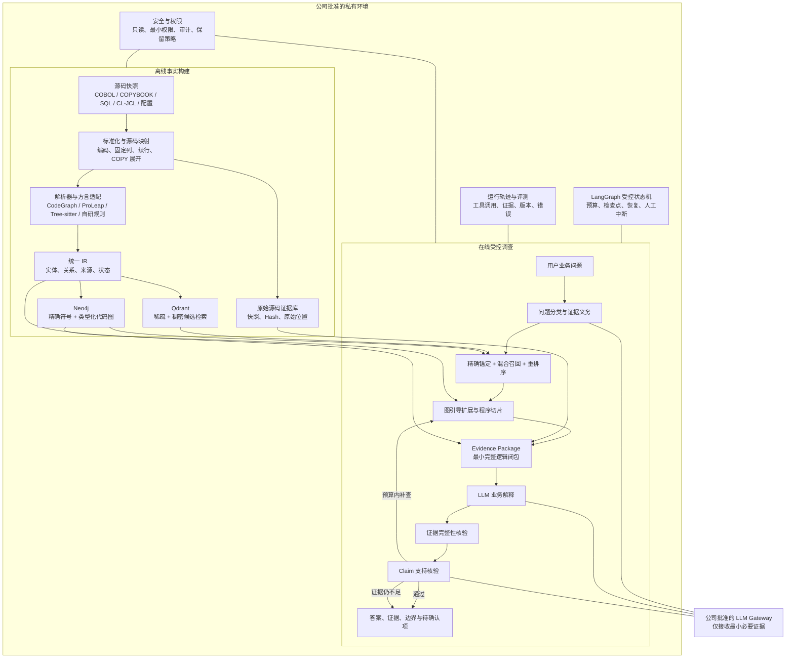

# COBOL 代码理解型 AI Agent 总设计说明书

> 核心判断：这个产品不是“把代码切块后交给大模型聊天”，而是一套以源码为唯一权威的自动调查系统。它先像编译器一样恢复程序结构与关系，再用混合 RAG 找到调查入口，沿确定性代码图收集证据，最后才让大模型把证据翻译成业务语言。

版本：`v0.1`  
状态：`Target architecture / deferred behind demonstrable POC`  
日期：2026-08-29  
当前实施基线：[可演示 POC](./docs/09-demonstrable-poc.md)  
适用范围：IBM i / AS400、通用 COBOL，以及后续在公司内适配的 DXC Smart COBOL 香港保险系统

> 实施快照（2026-08-31）：P3-A 已实现公司 API 能力探测、四工具白名单、最多六步的单 Agent 循环、Evidence 范围/Hash/快照核验和固定四段回答。真实公司 API 与独立 Claim 语义支持核验尚未完成，因此当前实现会把只通过引用完整性和词面锚定的回答限制为 `PARTIAL`。执行细节见 [P3-A 进度报告](./docs/reports/2026-08-31-p3a-progress-report.md)。

## 1. 设计结论

这个 Agent 可以实现，但可信版本不能只靠 LLM，也不能只靠向量数据库。系统必须组合四种能力：

1. **解析与静态分析**把源码变成 Program、Paragraph、Field、SQL、调用、控制流和数据流等可查询事实；
2. **混合 RAG**把中文业务问题映射到可能相关的源码实体；
3. **图引导调查**沿 `PERFORM / CALL / GO TO / READS / WRITES / FLOWS_TO` 等真实关系恢复完整逻辑；
4. **受控 Agent**根据问题类型反复定位、追踪、检查和补查，最后生成有证据、有限定、能拒答的业务说明。

因此，产品的核心资产不是某个模型或向量库，而是版本化源码、统一中间表示、企业方言规则、代码关系图、调查契约和专家确认的评测集。模型、解析器、Agent 框架和存储都必须可以替换。

## 2. 产品目标

### 2.1 要解决的核心问题

用户导入一个私有 COBOL 代码库并完成本地索引后，可以直接提出业务问题，例如：

- 某个保费、佣金、现金价值或准备金是怎样计算的？
- 这个字段在哪里定义，它在当前业务路径上的值从哪里来？
- 哪些客户类型、保单状态、日期或异常条件会改变结果？
- 从入口程序到目标计算经过哪些 `PERFORM` 和 `CALL`？
- 当前源码能证明什么，哪些内容必须查看运行参数、外部系统或受限文档？

系统返回的不是普通代码摘要，而是一份可复核的调查结果：业务解释、公式或步骤、执行路径、数据来源、条件分支、源码证据、分析快照和待确认项。

### 2.2 第一阶段范围

第一阶段只做一个代码库、一个香港保险业务域、30–50 个相关程序和 20–30 个专家确认问题。先证明系统能够可信回答，再扩大覆盖范围。

第一版支持五种原子问题：

| 问题类型 | 要回答的事情 |
| --- | --- |
| `CALCULATION_EXPLANATION` | 一个结果如何由输入、运算、查表、条件和舍入得到 |
| `DATA_PROVENANCE` | 字段在哪里定义，以及运行时值从哪里来、如何传递 |
| `CONDITION_IMPACT` | 哪些条件会改变结果、状态或执行路径 |
| `EXECUTION_PATH` | 从入口到目标经过哪些程序和 Paragraph |
| `ANSWERABILITY_BOUNDARY` | 当前源码能证明什么、不能证明什么、缺少什么 |

### 2.3 第一版明确不做

- 不自动修改、提交或发布生产代码；
- 不把整个仓库直接发送给大模型；
- 不用模型微调“记住”公司源码；
- 不把向量相似度当成调用、赋值或业务规则证明；
- 不在证据能力达标前自动生成正式 UR、FS、TS；
- 不在公开环境导入公司源码、内部文档或付费 DXC 文档。

## 3. 核心原理

普通 RAG 的路径通常是“切块—向量检索—生成答案”。它适合文档问答，但对 COBOL 业务分析不够，因为两个代码片段语义相似，不代表它们在运行时相互调用，也不代表字段真的从一个流向另一个。

本系统采用两阶段 Code RAG：

```text
符号检索 + 稀疏检索 + 稠密向量 + 重排序
                    ↓
              找到候选入口
                    ↓
调用图 + 控制流 + 数据流 + SQL/File 关系 + 程序切片
                    ↓
              证明逻辑路径
                    ↓
        最小证据包 → 业务解释 → 双层核验
```

这套设计把“可能相关”和“已经证明”彻底分开：RAG 负责缩小搜索空间，解析器和类型化关系负责建立代码事实，LLM 负责计划调查与表达结论。

## 4. 总体架构



架构分为离线和在线两条路径。离线阶段把一个确定版本的代码库转换成可重建的代码事实；在线阶段围绕一个问题提取最小必要证据。只有最后的解释与语义核验需要 LLM，代码关系本身不由 LLM 生成。

## 5. 事实权威与数据模型

系统必须保持一条不可颠倒的权威链：

```text
版本化原始源码
    → 统一 IR
    → Neo4j / Qdrant 可重建查询投影
    → 单次调查的 Evidence Package
    → 待核验的自然语言回答
```

原始源码是最终证据。统一 IR 是规范化事实层。Neo4j 与 Qdrant 都只是派生索引，不是第二套真相。LLM 输出永远是待核验 claim，不能直接写回事实层。

### 5.1 统一 IR 的最小对象

实体至少包括：`RepositorySnapshot`、`SourceFile`、`Program`、`Section`、`Paragraph`、`Statement`、`Field`、`Copybook`、`DatabaseTable`、`DatabaseColumn`、`File`、`Job`、`ControlTable`。

关系至少包括：`CONTAINS`、`PERFORMS`、`PERFORMS_THRU`、`GOES_TO`、`CALLS`、`POSSIBLY_CALLS`、`READS`、`WRITES`、`FLOWS_TO`、`PASSES_AS`、`CONTROL_DEPENDS_ON`、`SELECTS_FROM`、`UPDATES`、`LOOKS_UP`、`REDEFINES`、`EXPANDS_COPY`。

每个事实都必须携带：

- `snapshot_id`、稳定 `entity_id` 和源码内容哈希；
- 原文件位置，以及 COPY 展开后的分析位置；
- 解析器、方言规则和 IR Schema 版本；
- 生成方式与完整上游依据；
- `relation_status`：`confirmed`、`candidate` 或 `unresolved`；
- 未解析原因和受影响的调查能力。

### 5.2 定义来源和值来源必须分开

这是 COBOL 字段分析最容易误判的地方：

- **Field Definition Origin** 回答字段在哪里声明，是否来自 COPYBOOK、层级结构或 `REDEFINES`；
- **Field Value Origin** 回答当前运行路径上的值来自参数、赋值、SQL、文件、控制表还是外部程序。

COPYBOOK 可以终止字段的定义追踪，但不能自动终止值追踪。字段在 COPYBOOK 中声明，不等于它的运行时值来自 COPYBOOK。

## 6. 离线代码理解流程

### 6.1 建立可复现源码快照

Repository Ingestor 读取获准范围内的源码和依赖，记录版本、文件哈希、编码、成员信息和依赖边界。任何问答都绑定到一个完整快照；源码变化后，旧证据不会被静默用于新版本。

### 6.2 标准化但保留原始位置

COBOL 的固定列、续行、字符编码、COPY/COPY REPLACING、条件编译和生成代码会改变解析输入。系统可以生成适合解析的展开文本，但必须保留：

```text
展开后语句位置 ↔ 原程序 COPY 位置 ↔ COPYBOOK 原始位置
```

没有这层双向映射，答案即使逻辑正确，也无法让分析人员回到真实源码复核。

### 6.3 解析器通过适配器输出统一 IR

CodeGraph、ProLeap、Tree-sitter 和自研规则都只是候选事实提取器。它们必须经过同一组私有样本 Bake-off，再通过适配器输出统一 IR。解析失败、动态调用、多义字段和未知框架语法必须成为显式 `unresolved` 事实，不能被跳过。

DXC Smart COBOL 的特有约定在公司环境中作为私有方言插件实现，不进入公开内核。公开项目只用通用 COBOL 和原创合成保险样本验证接口及算法。

### 6.4 从 IR 构建两个查询投影

- Qdrant 保存确定性渲染的代码文本、稀疏特征、稠密向量和必要元数据，用于候选发现；
- Neo4j 保存精确实体和类型化关系，用于符号验证、路径查询与程序切片；
- 两者使用相同的 `snapshot_id + entity_id`；
- 任一投影版本、实体或哈希不一致，当前快照立即停止服务并重新构建。

第一版不把 LLM 自动生成的代码摘要写入向量语料，以免错误摘要被长期索引并放大。

## 7. 在线调查流程

### 7.1 问题理解不是直接回答

Question Planner 先把用户问题拆成一个主类型和必要子问题，并为每个子问题生成“证据义务”。例如“这个保费怎样计算，费率从哪里来”至少包含一个计算解释和一个字段值来源调查。

证据义务不是提示词建议，而是回答门槛。一次计算解释至少需要确认目标字段、最终写入、运算顺序、每个输入来源、控制条件、查表以及舍入或覆盖写入。缺一项时，答案必须标为部分结论或继续调查。

### 7.2 精确符号优先于相关性排名

用户问题中出现的 Program、Paragraph、Field 或 Table 名先在当前快照中验证：

- 唯一命中时成为锚定种子；
- 多义且会产生不同答案时请求最小澄清；
- 未命中时只能作为搜索词，不能在答案中伪装成真实实体。

锚定种子不参加普通 RRF 排名，避免一个已确认字段被语义相似片段压低。

### 7.3 混合检索只负责找入口

对非锚定内容，Qdrant 组合两类信号：

- 稀疏通道匹配 COBOL 标识符、连字符词、缩写、注释、SQL、错误码和文件名；
- 稠密通道把中文业务表达映射到英文缩写和代码语义。

Qdrant 使用 RRF 融合稀疏与稠密候选，Reranker 只重排非锚定候选；应用层再合并锚定种子与重排结果。前 5–10 个实体进入图调查。具体数量必须由私有评测校准，不写死为产品规则。

### 7.4 图调查证明关系

Agent 只允许使用当前问题对应的关系白名单：

| 问题 | 首要调查方向 |
| --- | --- |
| 计算解释 | 从最终写入反向追踪 `READS / FLOWS_TO / PASSES_AS`，再补条件、调用、查表与舍入 |
| 数据来源 | 分别追定义 lineage 与值 lineage，直到参数、SQL、文件、控制表或外部边界 |
| 条件影响 | 从结果写入向控制依赖扩展，覆盖 ELSE、88 级、默认与异常路径 |
| 执行路径 | 沿 `CALLS / PERFORMS / GOES_TO` 查找有序路径，动态边保留候选状态 |
| 可回答边界 | 记录未解析引用、外部依赖、运行时配置和源码缺口 |

图扩展受节点数、关系深度、工具调用数、时间和证据 token 预算共同限制。循环和递归以强连通分量或循环段压缩，不能无界展开。

### 7.5 Evidence Package 是 LLM 唯一可用上下文

Evidence Builder 把必要源码片段、实体、关系路径、分支条件、未解析边界和证据义务整理为一次调查的只读证据包。它追求“最小完整逻辑闭包”：既不能漏掉支撑结论的关键关系，也不能把整个仓库塞给模型。

### 7.6 双层核验决定回答还是拒答

回答生成后执行两层不同性质的检查：

1. **Evidence Integrity Validator** 以确定性规则检查快照、源码哈希、实体、关系路径和引用是否真实且一致；
2. **Claim Support Checker** 把每条结论标成 `supported`、`overstated` 或 `unsupported`，检查是否超出了证据适用范围。

模型可以辅助第二层的语义比对，但不能把不存在的证据升级为“已支持”。验证失败且仍有预算时继续补查；没有进展、超出边界或快照失效时给出部分回答或拒答，并说明停止位置和继续所需资料。

## 8. Agent 控制模型

第一版采用一个受控 Agent，不使用多个自由协作 Agent。LangGraph 承载状态、检查点和恢复，但项目自己的状态与工具契约才是产品语义：

```text
UNDERSTAND
  → CLARIFY | LOCATE
  → SELECT_RELATIONS
  → EXPAND_EVIDENCE
  → CHECK_SUFFICIENCY
  → COMPOSE
  → VERIFY_EVIDENCE
  → VERIFY_CLAIMS
  → ANSWER | EXPAND_WITHIN_BUDGET | CLARIFY | ABSTAIN
```

每次工具调用必须满足“单调进展”：关闭至少一个证据义务、缩小候选范围，或明确一个不可跨越的边界。连续调用没有进展时立即停止，避免 Agent 在代码图里反复搜索。

只有用户能通过一个选择消除且会实质改变答案的歧义才需要澄清。源码无法解释业务原因、生产运行值、未提供的外部程序或受限文档时，系统应陈述边界，而不是要求用户猜测。

## 9. 组件职责

| 组件 | 输入 | 输出 | 明确不负责 |
| --- | --- | --- | --- |
| Repository Ingestor | 仓库位置与快照配置 | 文件、版本、依赖和权限范围 | 解释业务含义 |
| Source Normalizer | 原始源码 | 标准化分析文本与双向源码映射 | 删除原始证据 |
| Parser Adapter | 标准化源码 | 统一 IR 事实与未解析记录 | 生成自然语言答案 |
| IR Builder | 解析结果与方言规则 | 版本化实体、关系和来源 | 绑定某个图数据库 |
| Index Projector | IR 与源码 | Qdrant、Neo4j 可重建投影 | 成为事实权威 |
| Question Planner | 用户问题与支持能力 | 原子问题、证据义务、调查计划 | 创造代码事实 |
| Symbol Resolver | 显式标识符与快照 | 唯一、多义或未验证结果 | 做语义猜测 |
| Hybrid Retriever | 查询变体与范围 | 带信号来源的候选入口 | 证明调用或数据关系 |
| Graph Investigator | 锚点、关系策略与预算 | 路径、切片、歧义和边界 | 润色业务语言 |
| Evidence Builder | 图路径、IR 与源码 | 有序 Evidence Package | 补造缺失事实 |
| Answer Composer | 问题与证据包 | 结构化事实、推断和待确认项 | 读取整个仓库 |
| Evidence Integrity Validator | 证据包与事实层 | 一致、失效或结构缺口 | 判断业务语义 |
| Claim Support Checker | 回答与已验证证据 | 支持状态和补查义务 | 用主观置信度替代证据 |
| Trace & Evaluation | 全链路版本和结果 | 可重放轨迹、指标和错误分类 | 存储无边界的敏感提示词 |
| LLM Gateway | 最小问题上下文和证据 | 规划或解释结果 | 获得仓库任意读取权限 |

## 10. 当前目标技术栈

| 层 | 当前选择 | 状态与理由 |
| --- | --- | --- |
| 应用形态 | Python 3.12+ 模块化单体 | `Proposed`；方便统一版本、审计和本地部署，JVM 解析器可由隔离 Worker 调用 |
| Agent 编排 | POC 使用普通 Python 六步循环 | `Current`；LangGraph 只保留为未来公司批准环境中的可选升级 |
| 解析 | CodeGraph、ProLeap、Tree-sitter 与自研补充 Bake-off | `Open`；真实 DXC 方言关系正确性决定最终组合 |
| 检索 | SQLite FTS5 + 可选公司 API Embedding | `Current POC`；不安装向量服务，未来只在公司提供或批准服务时升级 |
| 精确符号与关系 | SQLite 符号/关系表 + 内存三跳 | `Current POC`；图服务不是演示前置条件 |
| Embedding | 公司 API 可选能力 | `Optional / off by default`；没有获准 Embedding 接口时使用精确符号和 FTS5 |
| Reranker | 公司 API 可选能力 | `Deferred`；POC 不安装本地重排模型 |
| 向量模型比较 | 公司 API 已批准模型 | `Deferred`；不得在工作电脑下载 Qwen/BGE 等模型 |
| LLM | 公司 API Key 调用公司批准模型 | `Required`；不安装本地模型运行时，API Key 不落盘、不入日志 |
| 本地存储 | SQLite | `Current POC`；Python 自带、单文件、无需后台服务 |

选择 Qdrant 与 Neo4j 会增加一套索引一致性和运维成本，因此它们不是永久锁定。M3 必须用同一私有问题集对比双引擎与降级方案；只有正确证据召回、路径恢复和运维收益足够明显，ADR 才能从 `Proposed` 转为 `Accepted`。

## 11. 隐私与安全设计

公司源码、向量、图索引、业务术语和问答轨迹都视为敏感数据。最低安全边界如下：

- 源码、统一 IR、Qdrant 和 Neo4j 只部署在公司批准环境；
- 仓库接入使用只读凭证，并按项目、业务域和用户权限过滤检索；
- LLM Gateway 只发送完成当前问题所需的最小证据包；
- 未经批准不得调用外部公共模型，不得用公司代码训练个人模型；
- 向量不是脱敏数据，备份、导出、日志和缓存采用与源码相同的管控等级；
- Qdrant、Neo4j 和 API 启用认证、加密传输、网络隔离与最小权限；
- 轨迹保留问题、工具动作、实体 ID、版本和必要证据引用，原始源码片段的日志保留策略由公司审批；
- 公开开发环境只保留通用内核、公开资料和原创合成样本。

具体身份系统、密钥管理、日志期限和模型供应商仍需公司安全评审，本设计不预设未经确认的合规结论。

## 12. 非功能目标

| 维度 | 第一版设计目标 | 验证阶段 |
| --- | --- | --- |
| 准确性 | 任何代码事实都必须有证据；流畅回答不能弥补证据缺失 | M2–M5 |
| 可追溯性 | 每条事实回到快照、实体、源码位置和关系路径 | M3 |
| 可复现性 | 相同源码、解析器、规则、模型和配置可以重放调查 | M3–M5 |
| 隐私 | 源码和派生索引留在批准环境，模型只看最小证据 | M3–M6 |
| 可替换性 | 解析器、存储、Embedding、Reranker 和 LLM 均有适配边界 | M0–M3 |
| 可维护性 | 方言规则、IR Schema 和关系提取规则都有版本及回归样本 | M2–M6 |
| 性能 | 索引后的常见单跳问题以 30 秒内首答为初始目标，多跳问题显示调查进度 | M1 校准、M5 验证 |
| 成本 | 优先本地批处理、增量重建和有预算的在线调查 | M3–M6 |

当前没有真实代码规模、并发量和公司可用基础设施，因此可用性、容量、RPO/RTO 和正式响应时间不能在 M0 阶段凭空承诺。

## 13. 质量评测与验收

评测必须按层定位错误，不能只看最终答案“像不像正确”：

| 层级 | 关键问题 | 首版目标 |
| --- | --- | --- |
| 解析 | Program、Section、Paragraph 是否识别正确 | 识别率 ≥98% |
| 关系 | `PERFORM/CALL` 是否提取完整且准确 | 精确率 ≥95%，召回率 ≥90% |
| 问题规划 | 类型、子问题和证据义务是否完整 | 建立 Macro-F1、覆盖率和白名单违规指标 |
| 候选检索 | 正确入口是否被找到 | Top-5 包含正确证据路径 ≥85% |
| 图调查 | 是否恢复完整且可复核的路径 | 逐问题比较金标准关系与边界 |
| 证据完整性 | 每条代码事实是否有有效 `evidence_id` | 目标 100% |
| 虚构控制 | 是否生成不存在的实体或源码位置 | 硬目标 0 次 |
| 回答可用性 | 业务分析师能否直接用于调查或复核 | 目标 ≥80% |
| 拒答 | 是否能识别静态源码无法证明的问题 | 同时评估精确率与召回率 |

这些数字是 M1 后需要用私有样本校准的退出门槛，不是当前已经达到的结果。首批 20–30 个金标准问题必须同时标注正确答案、必要源码证据、关系路径、歧义、允许推断和必须拒绝的部分。

模型与检索选型采用消融实验：依次比较 exact-only、sparse-only、dense-only、sparse+dense、加入 reranker、加入图扩展，以及 Qwen3 与 BGE-M3。只有可测量地提高正确证据召回或降低无关上下文的组件才保留。

## 14. 里程碑

| 里程碑 | 核心交付物 | 退出条件 |
| --- | --- | --- |
| **P0–P4 可演示 POC** | Windows 文件夹、本地混合索引、4 个只读工具、单 Agent、源码引用界面 | 4 个标注问题正确、1 个未预写问题有用、1 个不可回答问题拒答 |
| **M0 架构与契约** | 总体架构、问题矩阵、统一 IR、工具和 Evidence Package 契约、ADR | POC 证明需要扩大后再闭合；每个组件的输入、输出、失败方式和替代方案明确 |
| **M1 代码库画像与问题基线** | 私有代码画像、5 个挑战程序、20–30 个金标准问题 | 范围和证据由专家确认，私密材料不越界 |
| **M2 解析器 Bake-off** | 方言缺口矩阵、结构和关系指标、选型 ADR | 达到结构与调用关系门槛，关键缺口有补偿方案 |
| **M3 事实层与索引** | 版本化 IR、源码映射、Qdrant/Neo4j 投影、增量失效 | 事实可回源，索引键一致且可重建，完成容量与运维基准 |
| **M4 调查工具** | 符号解析、混合召回、图追踪、程序切片和 Evidence Package | Top-5 与多跳路径达到金标准门槛，不依赖 LLM 也能取对证据 |
| **M5 只读 Agent MVP** | 有限状态调查、回答器、双层核验和工作台 | 不虚构源码实体，代码事实证据完整，能正确部分回答和拒答 |
| **M6 真实业务试点** | 一个业务域的受控内网试点、审计和回归报告 | 安全评审通过，结果可复现，主要错误持续下降 |
| **M7 业务地图与影响分析** | 领域候选图、术语映射和架构差异分析 | 聚类稳定、差异可解释，不把推测当事实 |
| **M8 SDLC 分析协作** | UR/FS/TS 草案、测试场景和人工审批流程 | 只在 M6/M7 长期达标后启动 |

完整产品扩展仍受四条停止线约束：M2 不通过就不扩大解析范围；M4 取不到正确证据就不进入正式 Agent MVP；M5 仍虚构代码事实就不进真实试点；数据与模型边界未批准就只使用合成样本。这些门槛不阻止当前轻量 POC，但 POC 的回答必须带源码引用并能拒答。

## 15. 主要风险与架构应对

| 风险 | 可能造成的错误 | 当前应对 |
| --- | --- | --- |
| DXC 方言或框架语法无法解析 | 丢失调用、字段或控制关系 | 私有方言插件、未解析记录、挑战样本和解析器 Bake-off |
| 动态调用或表驱动路由不唯一 | 把候选路径写成确定路径 | `POSSIBLY_CALLS`、候选条件、运行时边界和拒答 |
| COPY 展开丢失来源 | 无法回到真实代码复核 | 原始位置与展开位置双向映射 |
| 字段别名、REDEFINES 和参数传递复杂 | 数据来源链断裂或误连 | 统一 IR 显式建模，逐跳保留状态和证据 |
| 向量找到相似但无关的代码 | 回答主题正确但逻辑错误 | 精确锚定优先，向量只找入口，图关系负责证明 |
| 图扩展过宽 | 上下文爆炸、成本和延迟失控 | 问题关系白名单、程序切片、SCC 压缩和多维预算 |
| 两个索引版本不一致 | 混用旧实体和新源码 | 单一快照状态、幂等构建、哈希检查和失效即停答 |
| 模型把业务推断写成代码事实 | 形成具有迷惑性的错误结论 | 事实/推断/待确认分层，证据完整性与 Claim 支持双检 |
| 私密代码泄漏到外部服务或日志 | 不可逆的数据风险 | 私有部署、最小证据、网关、最小权限和审计 |

## 16. 当前状态与下一步

完整目标架构已经完成一次复检并获得 **有条件通过**，但当前不再继续扩大设计。项目主线已经切换到 [可演示 POC](./docs/09-demonstrable-poc.md)：先证明 Windows 文件夹、本地混合检索、四个只读工具和单 Agent 能够产生带真实行号的业务回答。

当前已经完成：

- 产品目标与只读 MVP 边界；
- 总体架构、事实权威和双环境边界；
- 五类原子问题及其证据义务；
- 在线 Agent 状态机与双层核验；
- LangGraph、Qdrant、Neo4j、Qwen3/BGE-M3 的候选选型；
- 解析器 Bake-off 与分层评测策略。

统一 IR 与完整 Agent 工具契约保留为未来演进边界，不作为 POC 前置条件。公开侧现已完成离线画像、SQLite/FTS5 结构索引、四个受限调查工具、公司 API capability probe 和最多六步的 Agent 骨架；CALC-01 已在 4 次真实工具调用内完成离线闭环，70 项自动测试全部通过。下一切片是在公司批准环境验收真实 API 并接入独立 Claim 语义支持核验。真实公司代码画像、DXC 方言适配和业务金标准只能在公司批准环境内执行。DDL/DDS、Job Schedule、DB File、Item Table 和运行数据未下载，必须作为回答边界；Embedding、图服务与 LangGraph 继续暂缓。

## 17. 详细设计索引

- [产品章程](./docs/00-product-charter.md)
- [架构基线](./docs/01-architecture-baseline.md)
- [路线图与里程碑](./docs/02-roadmap-and-milestones.md)
- [评估策略](./docs/03-evaluation-strategy.md)
- [混合 Code RAG Agent 框架](./docs/04-agent-framework.md)
- [架构设计与实施流程](./docs/05-design-process.md)
- [问题分类与调查策略矩阵](./docs/06-question-investigation-matrix.md)
- [统一 IR 与关系 Schema](./docs/07-unified-ir-and-relations.md)
- [Agent 调查工具契约](./docs/08-agent-tool-contracts.md)
- [可演示 POC：Windows 文件夹到业务回答](./docs/09-demonstrable-poc.md)
- [2026 RAG、向量与图框架选型报告](./docs/research/2026-rag-vector-framework-review.md)
- [解析器验证计划](./docs/research/parser-bakeoff-plan.md)
- [M0 架构复检记录](./docs/reviews/2026-08-28-m0-architecture-recheck.md)
- [ADR-0001：证据优先的只读 MVP](./docs/adr/0001-evidence-first-read-only-mvp.md)
- [ADR-0002：解析器中立的类型化多图](./docs/adr/0002-parser-neutral-typed-multigraph.md)
- [ADR-0003：先采用模块化单体](./docs/adr/0003-modular-monolith-first.md)
- [ADR-0004：通用内核与私有企业知识分离](./docs/adr/0004-separate-generic-core-and-private-enterprise-knowledge.md)
- [ADR-0005：采用混合 Code RAG](./docs/adr/0005-hybrid-code-rag.md)
- [ADR-0006：LangGraph + Qdrant + Neo4j 目标实现栈](./docs/adr/0006-adopt-langgraph-qdrant-neo4j-target-stack.md)
- [ADR-0007：Agent 使用受约束领域工具](./docs/adr/0007-use-bounded-domain-tools.md)

## 18. 参考技术资料

- [LangGraph 官方文档](https://docs.langchain.com/oss/python/langgraph/overview)
- [Qdrant Hybrid Queries](https://qdrant.tech/documentation/search/hybrid-queries/)
- [Qdrant Multivector](https://qdrant.tech/documentation/tutorials-search-engineering/using-multivector-representations/)
- [Qdrant Security](https://qdrant.tech/documentation/tutorials-operations/secure-qdrant/)
- [Neo4j GraphRAG for Python](https://neo4j.com/docs/neo4j-graphrag-python/current/)
- [Qwen3 Embedding and Reranker](https://github.com/QwenLM/Qwen3-Embedding)
- [BGE-M3](https://github.com/FlagOpen/FlagEmbedding/blob/master/docs/source/bge/bge_m3.rst)
