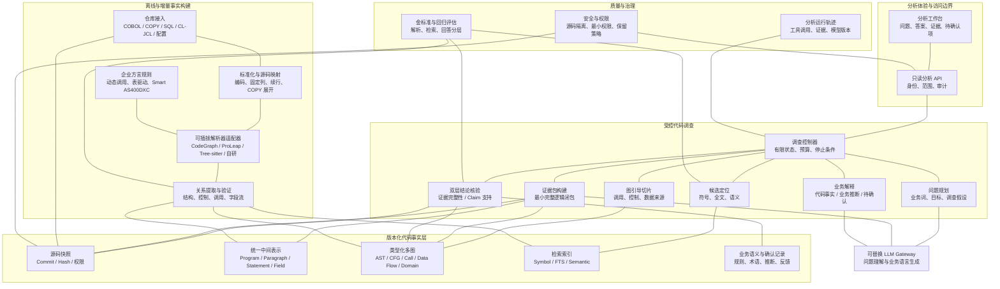
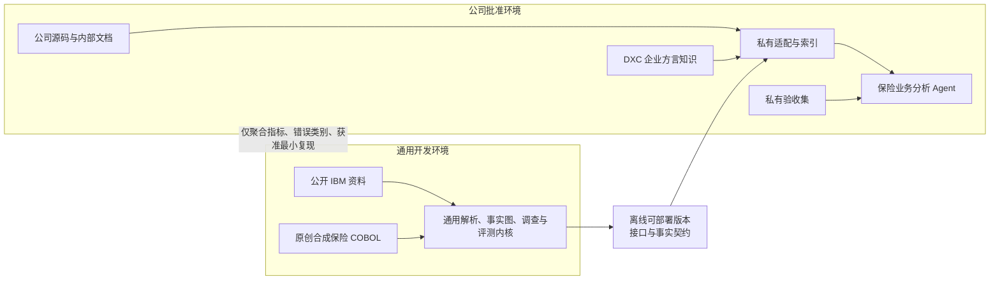

# 架构基线：源码证据型 COBOL 业务分析 Agent

> 核心判断：系统应当像“编译器 + 调查工具 + 受控 Agent”一样工作。离线阶段把源码转换为可查询事实；在线阶段只围绕问题提取最小完整逻辑闭包；大模型负责解释，不负责创造代码事实。

状态：`Target architecture baseline — deferred behind POC`  
范围：只读业务问答产品及其可演进基础  
当前轻量实现见：[可演示 POC](./09-demonstrable-poc.md)  
日期：2026-08-27

## 1. 架构驱动因素

本系统首先优化准确性、可解释性、源码隐私和可替换性，而不是追求最低延迟或最大自动化。几个关键约束决定了架构形态：

- 单个 COBOL 程序可能有数万行，并通过 `PERFORM`、静态/动态 `CALL`、COPYBOOK、SQL、文件和控制表跨越大量代码。
- 业务问题使用中文和业务术语，代码使用缩写、企业命名和框架约定，两者不能只靠文本匹配连接。
- 同一结论可能同时依赖控制流、数据流和跨程序参数；单一向量索引不能恢复这些关系。
- 公司源码具有敏感性，索引、模型调用、日志和缓存必须服从内网边界与权限。
- 公司源码、内部文档和付费 DXC 文档不能进入本项目的公开开发环境，通用能力与企业私有知识必须物理和逻辑分离。
- 解析器、基础模型和 Agent 框架都会变化，产品事实模型不能锁死在其中任何一个工具上。

## 2. 逻辑组件架构



图中最重要的限制是：LLM 不直接成为事实来源，也不能绕过证据包向事实层写入结论。人工确认的业务术语和规则可以进入业务语义记录，但必须保留确认人、依据和适用版本。

## 3. 双环境开发与运行边界



通用开发环境只负责标准 COBOL/IBM i 结构、统一事实契约、调查流程和合成保险评测。公司环境负责读取真实源码、解释 DXC 约定、建立真实索引并运行私有验收。两边共享接口和测试格式，不共享受限企业语料。

这意味着通用内核可以作为个人项目独立开发，但在公司内完成适配前，产品只能声称“支持通用 COBOL”，不能声称已经理解 DXC Smart COBOL。公司环境的大模型通道已经确定：只使用公司 API Key 调用公司 API，不安装本地模型运行时；应用只发送当前问题所需的最小证据，API Key 不落盘、不入日志。

## 4. 两条运行路径

### 离线事实构建

系统对一个确定的源码快照执行标准化、解析、关系提取和验证。COPYBOOK 可以展开供分析，但必须保留展开位置与原始文件位置的双向映射。每次增量更新只重建变化文件及受依赖影响的关系，不能静默复用过期证据。

### 在线代码调查

用户问题先被拆成业务概念、目标字段、行为和约束。问题中显式出现且能够验证的源码符号直接成为锚定调查种子；其余业务词和别名进入稀疏/稠密混合召回与重排序，不能让语义候选覆盖精确符号。找到入口后沿问题特定关系图扩展，构造最小完整逻辑闭包。

回答生成后执行双层核验：第一层确定性检查快照、实体、源码哈希、关系路径和证据引用是否完整；第二层检查每条 claim 是否被证据支持、是否扩大了适用范围。任一层失败时，在剩余预算内继续调查；证据不足、索引不一致或关系仍有歧义时必须拒答或标记待确认。

第一版调查控制器采用确定性、有限循环，而不是自由多 Agent：

```text
理解问题 → 必要时澄清 → 定位候选 → 选择关系图 → 扩展证据 → 判断是否充分
         → 生成回答 → 双层核验 → 通过 / 在预算内补查 / 拒答
```

LangGraph 作为当前状态机运行时，承载检查点、恢复、人工中断和轨迹；它仍不是准确性来源。调查状态、工具契约、预算和停止条件由项目定义，不能被框架内部对象取代。

## 5. 统一事实模型

事实权威顺序不可颠倒：

1. 版本化原始源码是最终可引用证据；
2. 统一 IR 是由源码、解析器和方言规则生成的规范化事实表示；
3. Neo4j 与 Qdrant 是从 IR 生成、可以全部重建的查询投影；
4. Evidence Package 是一次调查对事实的只读选择；
5. LLM 生成的回答只能成为待核验 claim，不能回写为代码事实。

如果 IR、图索引、向量载荷或源码哈希不一致，当前分析快照立即失效，系统不得在冲突数据上继续回答。

### 核心节点

`RepositorySnapshot`、`SourceFile`、`Program`、`Section`、`Paragraph`、`Statement`、`Field`、`Copybook`、`DatabaseTable`、`DatabaseColumn`、`File`、`Job`、`ControlTable`、`BusinessConcept`、`BusinessRule`。

### 核心关系

`CONTAINS`、`PERFORMS`、`PERFORMS_THRU`、`GOES_TO`、`CALLS`、`POSSIBLY_CALLS`、`PASSES_AS`、`READS`、`WRITES`、`FLOWS_TO`、`SELECTS_FROM`、`UPDATES`、`LOOKS_UP`、`EXECUTED_BY`、`MAPS_TO_CONCEPT`、`EVIDENCES`。

### 每条事实必须携带

- 源码快照标识、文件哈希和原始位置；
- 解析器、方言规则和事实模型版本；
- 生成方式：语法解析、静态推导、人工确认或模型推断；
- 关系状态：`confirmed`、`candidate` 或 `unresolved`，以及未解析原因；
- 若为派生关系，保留完整上游证据路径。

仅保存行号不够，因为源码改动会让行号漂移；至少应同时保存内容哈希、结构实体标识和源码范围。

## 6. 多图原则

代码库不是“一张图”。不同问题使用不同关系：

| 问题 | 首选关系层 |
| --- | --- |
| 运行时会执行什么 | `PERFORM / CALL / GO TO` 调用与控制流 |
| 字段如何计算 | `READS / WRITES / FLOWS_TO / PASSES_AS` 数据流 |
| 哪些文件构成业务域 | 词汇、调用、依赖与经验证的共变更关系 |
| 改动会影响哪里 | 反向依赖、数据流、调用和作业关系 |
| 架构文档是否符合代码 | 假设架构与实际依赖的 Reflexion 对比 |

关系可以存放在同一属性图或关系数据库中，但类型和来源不能被抹平。只有在“业务域发现”这类问题中，才允许对规范化后的多层信号做显式加权，而且必须通过消融和稳定性评估证明每个信号确实有贡献。

对调用和依赖图，应先识别强连通分量，避免循环关系被聚类算法任意拆开；对跨域发现，应过滤日志、通用错误、基础 COPYBOOK 等全局高频节点，防止它们把所有业务域错误地吸在一起。

## 7. 业务语义不是代码事实

事实层只证明系统“做了什么”；业务语义层解释“这可能代表什么”。系统输出必须使用三种明确标签：

- **代码事实**：由证据链直接支持；
- **业务推断**：基于命名、上下游和上下文解释；
- **待确认项**：源码不能证明业务原因、生产配置值或外部行为。

业务专家确认后，推断可以升级为“人工确认的业务语义”，但不能反向伪装成代码本身已经证明的事实。

## 8. 初步部署形态

第一阶段采用 Python 模块化单体，内部保持接入、解析适配、统一 IR、检索、事实图、调查、核验、评估和 API 边界。若选择 JVM 解析器，可以通过受控子进程或独立解析 Worker 隔离运行时，但产品仍保持统一版本和统一审计。

当前目标部署包含两个本地派生索引：Qdrant 负责稀疏/稠密混合召回和重排序前候选，Neo4j Community 负责精确符号与类型化代码图查询。它们共享 `snapshot_id + entity_id`，都可以从版本化 IR 重建。第一阶段仍不引入 Kafka、多个自治 Agent 服务、OpenSearch 或云托管知识库。

双引擎选择在 M3 前保持 `Proposed`。若私有基准证明收益不足、公司环境不批准或运维代价过高，则通过适配器降级到 LanceDB，或 PostgreSQL + pgvector；不改变 IR、工具和证据包契约。

## 9. 非功能要求基线

| 类别 | 首版要求 |
| --- | --- |
| 准确性 | 代码事实必须可复核；不以流畅度替代证据完整性 |
| 可解释性 | 每条事实可回到源码快照、实体、位置和关系路径 |
| 隐私 | 源码与索引留在批准环境；模型只接收最小必要证据 |
| 安全 | 项目级访问控制、只读仓库凭证、查询与导出审计 |
| 可复现性 | 相同源码、解析器、规则和模型版本可重放分析 |
| 可替换性 | 解析器、LLM、向量模型和存储通过适配边界替换 |
| 性能 | 索引后常见单跳问题目标在 30 秒内给出首答，多跳调查允许更长并显示进度；M1 校准 |
| 可维护性 | 方言规则和事实模式有版本、测试样本和变更记录 |
| 成本 | 优先本地批处理、增量索引和有预算的 Agent 循环 |

## 10. 主要失败模式

| 失败 | 后果 | 架构应对 |
| --- | --- | --- |
| 解析器跳过企业方言 | 缺失调用或错误字段关系 | 方言适配器、未解析节点、覆盖率报告、金标准样本 |
| 动态 `CALL` 无法唯一解析 | 错误调用链 | 生成候选边和条件，标记 `POSSIBLY_CALLS`，不得伪装为确定关系 |
| COPY 展开丢失来源 | 证据无法复核 | 原始/展开双向源码映射 |
| 向量检索找到相似但无关代码 | 回答跑偏 | 向量只负责入口发现，最终由图关系与源码核验 |
| 图扩展过宽 | 上下文爆炸、成本失控 | 问题特定关系、深度/节点预算、最小完整逻辑闭包 |
| 业务推断被写成事实 | 误导 SDLC 决策 | 三类结论标签、证据完整性与 Claim 支持双层核验、强制拒答 |
| 源码更新后引用过期 | 证据失效 | 快照绑定、文件哈希、增量失效传播 |
| 业务域聚类不稳定 | 生成错误架构地图 | 多次运行一致性、专家基线、Reflexion、消融实验 |

## 11. 当前技术判断

- [Qdrant Hybrid Queries](https://qdrant.tech/documentation/search/hybrid-queries/) 原生支持稀疏/稠密、多阶段 prefetch、RRF/DBSF 和 multivector，适合把词汇、语义和 late-interaction 信号放在同一可消融检索管道中；精确符号由 Neo4j 单独验证，Qdrant 只提供候选相关性，不提供代码关系证明。
- [Neo4j GraphRAG for Python](https://neo4j.com/docs/neo4j-graphrag-python/current/) 和 [VectorCypherRetriever](https://neo4j.com/docs/neo4j-graphrag-python/current/user_guide_rag.html) 可以连接向量入口与属性图扩展；本项目只采用这种检索连接方式，禁止用 LLM Knowledge Graph Builder 生成代码事实边。
- [LangGraph](https://docs.langchain.com/oss/python/langgraph/overview) 适合作为可持久化的状态机运行时，但统一调查状态和工具契约仍归项目所有。
- [Qwen3 Embedding](https://github.com/QwenLM/Qwen3-Embedding) 作为中文、英文与代码语义检索基线，[BGE-M3](https://github.com/FlagOpen/FlagEmbedding/blob/master/docs/source/bge/bge_m3.rst) 作为 dense/sparse/multivector 挑战者；最终选择由公司内消融决定。
- [CodeGraph](https://github.com/colbymchenry/codegraph) 已公开列出 COBOL 的 Program、Section/Paragraph、`PERFORM/GO TO`、字面量 `CALL`、COPYBOOK、字段/88 级、CICS 与 SQL INCLUDE 等结构支持，适合作为快速索引候选；它没有在公开的跨文件覆盖表中给出 COBOL 基准，也没有公开证明字段级数据流、动态调用和跨程序参数映射足够满足本项目，因此必须实测。
- [ProLeap COBOL Parser](https://github.com/uwol/proleap-cobol-parser) 能生成 AST 和 ASG，并提供变量访问及部分控制/数据语义，且预处理 `COPY/REPLACE`；它把 EXEC SQL/CICS 主要作为文本提供，因此仍需扩展 SQL、CICS 和企业方言关系。
- [Joern](https://docs.joern.io/) 的 Code Property Graph 模型适合作为中间表示和查询思想参考，但官方支持语言列表没有 COBOL，不能直接作为 COBOL 解析器。
- Tree-sitter COBOL 解析器适合容错、快速和增量场景，但不同方言覆盖差异明显，应作为 Bake-off 候选而非默认答案。

因此当前决定的是“目标实现与验证顺序”，不是宣布框架已经胜出：所有工具必须通过同一证据契约、同一金标准问题和同一资源基准。
