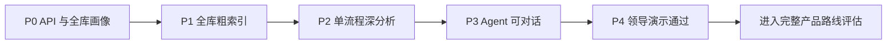
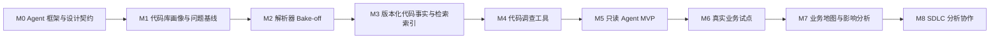

# 路线图与里程碑：用证据门槛推进，而不是按功能堆叠

> 核心判断：先对全部已下载 COBOL/COPYBOOK 做离线画像和粗索引，再按需深挖一个业务流程，在十至十五个工作日内形成“全库可搜索、单流程可证明”的演示闭环；完整架构不是 POC 前置条件。

状态：`Proposed`  
日期：2026-08-29

## 1. 当前 POC 先行路线

| POC 里程碑 | 可见交付物 | 退出门槛 |
| --- | --- | --- |
| **P0 API 与全库画像** | 公司 API 能力探测；全部下载文件的数量、编码、Program/COPY/CALL/PERFORM/SQL 和重复名统计 | 画像不含源码内容或标识符；Chat、Tool Calling/JSON 和 Embedding 能力已记录 |
| **P1 全库粗索引** | 全部 COBOL/COPYBOOK 的 L1 结构、SQLite FTS5、符号、直接关系和源码查看 | 支持断点重跑、Hash 复用；Program/Paragraph/Field 可搜索并回到真实行号 |
| **P2 单流程深分析** | `search_code / inspect_symbol / trace_relations / read_evidence` 与按需 L3 解析 | 一个业务流程的计算、字段来源、条件和跨程序路径能够取得必要证据 |
| **P3 Agent 可对话** | 六步有界工具循环、中文回答、证据展开和明确拒答 | 不使用预写答案，事实结论都有源码引用 |
| **P4 领导演示版** | Windows 启动脚本、六问演练、失败边界和演示说明 | 4 个标注问题正确、1 个未预写问题有用、1 个不可回答问题拒答 |

详细范围、分层索引、证据边界和 10–15 日计划见 [可演示 POC](./09-demonstrable-poc.md)。

## 2. 完整产品推进顺序（POC 后）

前六个里程碑解决的是“能否可信回答”；M7、M8 才解决“能否扩大分析范围和参与研发流程”。

项目从 M1 起采用两条同步但不交换私密语料的轨道：公开侧以原创香港保险合成样本开发通用内核；公司侧以真实代码建立私有验收集和 DXC 适配。两边只通过固定接口、聚合指标、错误类别和获准的最小复现对齐。

## 3. 完整产品里程碑定义

| 里程碑 | 要消除的不确定性 | 主要交付物 | 退出门槛 |
| --- | --- | --- | --- |
| **M0 Agent 框架与设计契约** | RAG、解析器、事实图、Agent 和 LLM 分别负责什么 | 混合 Code RAG 架构、LangGraph/Qdrant/Neo4j 目标栈、组件接口、在线状态机、NFR、关键 ADR、设计流程 | 架构评审能够解释每个组件的输入、输出、失败方式和替代方案；核心契约不依赖具体框架，目标栈有明确降级条件 |
| **M1 代码库画像与问题基线** | 一个真实代码库包含什么，以及第一版具体回答哪类问题 | 公司内源码画像、问题分类、5 个挑战程序、20–30 个私有问题；公开侧只准备必要的最小 fixture | 代码和依赖边界明确；问题、答案和必要证据可由专家确认；私密内容没有越界 |
| **M2 解析器 Bake-off** | 现成工具能否正确理解真实 COBOL 方言 | 候选解析器对比、方言缺口矩阵、关系精确率/召回率、选型 ADR | Program/Section/Paragraph 识别 ≥98%；`PERFORM/CALL` 精确率 ≥95%、召回率 ≥90%；关键缺口有明确补偿方案 |
| **M3 版本化代码事实与检索索引** | 系统能否把一次解析变成稳定、可追溯、可检索的事实底座 | 接入与标准化、统一 IR、Neo4j 类型化图、Qdrant 多路索引、源码映射、快照与增量失效 | 每条事实能回到源码快照和位置；两个派生索引键一致且可重建；Qdrant/Neo4j 通过质量、容量和运维基准 |
| **M4 代码调查工具** | 不依赖 LLM，仅凭工具能否找到正确逻辑闭包 | 符号/稀疏/稠密召回、RRF、重排序、调用追踪、字段溯源、控制路径、SQL/文件关系、证据预算与证据包 | 至少 85% 金标准问题的 Top-5 结果包含正确证据路径；关键多跳路径可复核；每个检索信号通过消融证明价值 |
| **M5 只读 Agent MVP** | LLM 能否把证据转成业务人员可用且不过度推断的答案 | 有限状态调查、问题规划、证据包、回答器、Evidence Integrity Validator、Claim Support Checker、简洁工作台 | 金标准集上不虚构源码实体和位置；代码事实证据覆盖目标 100%；业务可用性 ≥80%；能正确拒答 |
| **M6 真实业务试点** | 原型在真实权限、规模和日常调查中是否仍然成立 | 增量索引、权限审计、模型网关、评测回归、试点运行报告 | 一个业务域完成受控试点；结果可复现；安全与数据边界通过评审；主要错误有稳定下降趋势 |
| **M7 业务地图与影响分析** | 单问单答能力能否扩展到系统级认知 | 领域候选图、业务术语映射、架构 Reflexion、变更影响路径 | 多次运行结果稳定；与专家参考架构的差异可解释；不把聚类结果直接当事实 |
| **M8 SDLC 分析协作** | 是否有资格生成更高风险的研发产物 | UR/FS/TS 草案、测试场景、影响分析、人工审批流程 | 只在 M6/M7 持续达标后启动；所有产物保留证据、版本和审批责任 |

工期只能在拿到试点代码后估算。若以一名主力工程师加一名兼职业务专家为基准，M1–M2 通常是 3–5 周的验证工作；现在给整个产品承诺日期，会把最大的不确定性藏起来。

## 4. 完整产品停止线

以下停止线用于 POC 通过后扩大真实代码范围；不阻止当前轻量演示实现。

- **M2 不通过，就不开发 Agent。** 解析和关系抽取不可靠，后面的提示词优化只会让错误更流畅。
- **M4 不通过，就不调回答模型。** 正确证据没有进入上下文时，换模型不会解决检索失败。
- **M5 仍会虚构源码事实，就不进入真实试点。** 这不是“偶发体验问题”，而是产品资格问题。
- **源码权限和外部模型边界未批准，就只使用脱敏或合成样本。** 不用进度压力换取不可逆的数据风险。

## 5. 现在开始的十至十五个工作日

当前不继续设计 Evidence Package，也不部署图服务或复杂编排框架。按以下顺序完成第一条纵向闭环：

1. 先实现完全离线的 `repo_inventory`，由用户在公司本地对全部下载 COBOL/COPYBOOK 运行，只输出聚合画像；
2. 验证公司 API 的 Chat、Tool Calling/JSON 和可选 Embedding 能力，不记录 API Key；
3. 对全库建立 L1 Program/Paragraph/Field、COPY/CALL/PERFORM、SQLite FTS5 和源码行号映射；
4. 只有公司 API 提供获准 Embedding 时增加 L2 向量，并按内容 Hash 缓存；
5. 对一个人工标注业务流程按需提取字段读写、计算操作数、条件和最多三跳关系；
6. 实现四个只读工具和最多六步的单 Agent 调查循环；
7. 每个回答显示当前只有 COBOL/COPYBOOK，以及缺失 DDL/DDS、Job、DB File、Item Table 和运行数据的边界；
8. 加入界面、源码证据、一个未预写问题和一个拒答问题，并完成 Windows 彩排。

截至 2026-08-30，公开侧已经完成 `repo_inventory`、SQLite/FTS5 结构索引、四个只读调查工具、CALC-01 原创 fixture 和六步可执行证据演示；22 项自动测试全部通过。当前进入 P3 前半段：公司 API capability probe、受控 Agent 循环、回答与引用核验。真实公司代码库聚合画像和 DXC 适配仍只能在公司批准环境内执行。
