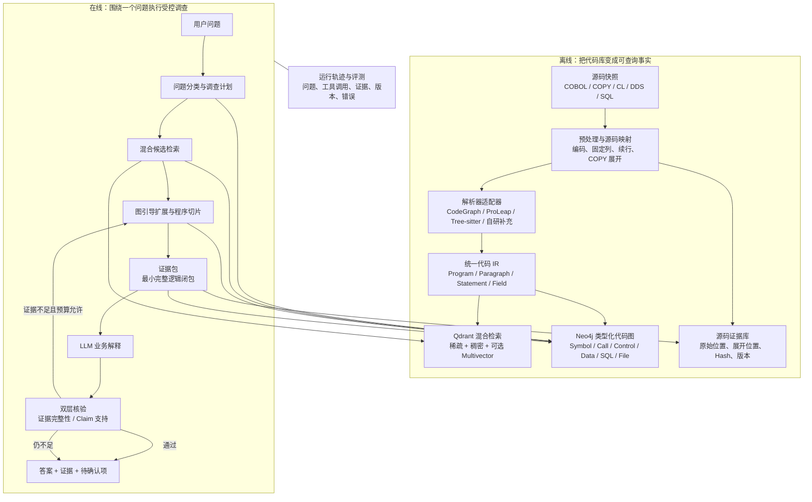

# 代码理解型 Agent 框架：混合 Code RAG

> 核心判断：这个产品需要 RAG，但不能采用“代码切块 → 向量 Top-K → LLM 总结”的普通 RAG。正确框架是混合 Code RAG：检索负责找到候选入口，类型化代码图和程序切片负责证明关系，LLM 只负责规划调查和解释证据。

状态：`Target architecture reference — deferred behind POC`  
范围：单个私有 COBOL/IBM i 代码库的只读业务分析 Agent  
当前轻量实现见：[可演示 POC](./09-demonstrable-poc.md)

公司约束：模型能力只能通过公司 API Key 调用公司 API。下文 Qdrant、Neo4j、Qwen、BGE-M3 和 LanceDB 仅是未来公司已有服务或重新审批时的参考选项，不安装在当前工作电脑，也不是 POC 依赖。

## 1. 系统要完成什么

用户把一个代码库交给系统建立本地索引，随后用自然语言提问，例如：

- 某个金额在哪里计算，完整公式是什么？
- 某个字段来自哪里，经过哪些程序和参数？
- 哪些条件会进入这一分支？
- 从入口到这段逻辑经过哪些 `PERFORM/CALL/GO TO`？
- 仅凭当前代码不能确认什么？

系统输出业务语言答案，同时给出源码快照、程序、Paragraph、字段、条件和关系路径。第一版不修改代码，不自动生成正式需求或设计文档。

## 2. RAG 在这里的准确位置

RAG 是“先取回外部知识，再生成回答”的模式，不等于向量数据库，也不等于 Agent 框架。对于代码库，四种能力各自解决不同问题：

| 能力 | 擅长 | 单独使用时的缺口 |
| --- | --- | --- |
| 符号检索 | 精确找到程序、字段、Paragraph、表名 | 用户往往使用业务词，不知道源码名称 |
| BM25/全文检索 | 缩写、注释、SQL、错误码和相近文本 | 文本共现不能证明执行或数据关系 |
| 向量语义检索 | 将业务语言映射到命名不同的候选代码 | 相似度不是调用、赋值或条件证据 |
| 类型化图查询 | 精确追踪调用、控制和字段流 | 需要先找到正确入口，也不擅长自然语言解释 |

所以在线调查采用两阶段：

```text
符号 + BM25 + 语义向量  →  找候选入口
类型化图 + 程序切片     →  找到并证明完整证据路径
```

向量分数只参与候选排序，不允许直接支撑代码事实。用户明确给出的程序、Paragraph 或字段名若能在当前快照中精确验证，应成为锚定调查种子，不与普通语义候选竞争；若图中没有证明某字段流向结果，回答不能因为两个代码块语义相似就声称存在数据关系。

## 3. 总体架构



## 4. 离线代码理解层

### 4.1 源码快照

每次索引绑定一个明确的仓库版本或文件快照。文件路径、内容哈希、编码、构建成员和依赖清单一并保存，避免代码更新后仍引用旧证据。

### 4.2 预处理与源码映射

COBOL 固定列、续行、COPY/COPY REPLACING、条件编译和生成代码会改变解析输入。系统可以构造展开后的分析文本，但必须保留“展开语句 ↔ 原程序 COPY 位置 ↔ COPYBOOK 原位置”的双向映射。

### 4.3 解析器适配器与统一 IR

解析器只负责产生事实，不拥有产品数据模型。CodeGraph、ProLeap、Tree-sitter 或自研规则都通过适配器输出统一实体和关系；解析失败必须生成显式 `unresolved` 记录，不能静默跳过。

统一 IR 至少包含：

- 实体：RepositorySnapshot、SourceFile、Program、Section、Paragraph、Statement、Field、Copybook、Table、Column、File、Job；
- 关系：CONTAINS、PERFORMS、PERFORMS_THRU、GOES_TO、CALLS、POSSIBLY_CALLS、READS、WRITES、FLOWS_TO、PASSES_AS、SELECTS_FROM、UPDATES；
- 证据属性：源码范围、内容哈希、解析器版本、生成方式、关系状态和未解析原因。

### 4.4 多索引而不是一个知识库

所有索引都从同一个 IR 和源码快照派生，但保持不同语义：

- Neo4j 的唯一键和属性索引负责精确实体定位；
- Qdrant 稀疏/BM25 通道负责标识符、注释、SQL、错误码和缩写；
- Qdrant 稠密及可选 multivector 通道负责业务词到代码候选的语义桥接；
- Neo4j 类型化图负责证明运行路径和字段流转；
- 源码证据库负责最终引用和复核。

## 5. 在线 Agent 状态机

第一版采用一个受控 Agent，不采用多个自由协作 Agent；LangGraph 只承载这个有限状态机的检查点、恢复、人工中断和运行轨迹：

```text
UNDERSTAND
  → CLARIFY | LOCATE
  → SELECT_RELATIONS
  → EXPAND_EVIDENCE
  → CHECK_SUFFICIENCY
  → COMPOSE
  → VERIFY_EVIDENCE
  → VERIFY_CLAIMS
  → ANSWER | EXPAND_WITHIN_BUDGET | CLARIFY | ABSTAIN
```

每个状态都必须有结构化输入输出、节点/深度/时间预算和失败返回。LLM 可以提出“下一步追踪字段 X 的写入点”，但不能自行宣称 X 来自某表；工具返回的事实才可以进入证据包。

LangGraph 是当前运行时选择，但不是事实来源。状态对象、工具输入输出、预算、证据包和停止条件由项目自己的契约定义；如果替换 LangGraph，调查语义和评测结果不得改变。

核验分成两层，不能合并成一个“模型打分”：Evidence Integrity Validator 以确定性规则检查快照、哈希、实体、关系路径和引用完整性；Claim Support Checker 再判断回答是否被已验证证据支持、是否扩大适用范围。第二层可以使用受约束模型辅助语义比对，但不能把缺失证据升级为已支持事实。

## 6. 按问题选择检索与图

完整的证据义务、关系白名单、停止条件和答案格式见 [问题分类与调查策略矩阵](./06-question-investigation-matrix.md)。这里仅保留架构摘要：

| 问题类型 | 候选定位 | 主要证明关系 | 调查方向 |
| --- | --- | --- | --- |
| 计算怎样完成 | 字段/Paragraph 符号 + BM25 + 语义 | WRITES、READS、FLOWS_TO、控制条件、CALL/PERFORM | 从结果字段反向切片，再补成功和异常路径 |
| 字段来自哪里 | 精确字段 + 同义词/缩写 | 定义：COPY/REDEFINES；值：READS、WRITES、PASSES_AS、SQL/File | 先区分定义来源和值来源，再反向追到各自边界 |
| 哪些条件影响结果 | 结果写入点 | CFG、条件支配、88 级、错误路径 | 从写入点向控制依赖扩展 |
| 谁调用这段逻辑 | 程序/Paragraph 符号 | CALLS、PERFORMS、GOES_TO | 反向调用图到入口 |
| 代码库有哪些业务域 | 词汇、调用、依赖、共变更 | 多层图和聚类 | M7 才做，不属于问答 MVP |

调用图、数据流图和词汇图不能被无条件压成一个权重。具体问题使用对应关系；只有业务域发现这类探索任务才组合多层信号，并通过消融验证权重。

## 7. 核心组件契约

| 组件 | 输入 | 输出 | 不负责 |
| --- | --- | --- | --- |
| Repository Ingestor | 仓库路径、快照配置 | 文件清单、依赖和版本 | 解释业务含义 |
| Parser Adapter | 标准化源码 | 统一 IR 事实、未解析记录 | 生成自然语言答案 |
| Index Builder | IR 与源码 | 符号、全文、向量和图索引 | 决定用户意图 |
| Question Planner | 用户问题、可用工具描述 | 问题类型、候选概念、调查计划 | 创造代码事实 |
| Hybrid Retriever | 计划、查询词、范围 | 带来源的候选入口 | 证明完整执行关系 |
| Graph Investigator | 入口、关系类型、预算 | 程序切片、路径和歧义 | 业务语言润色 |
| Evidence Builder | 切片、源码和快照 | 有序证据包 | 补充缺失事实 |
| Answer Composer | 问题、证据包 | 事实/推断/待确认答案 | 读取整个代码库 |
| Evidence Integrity Validator | 证据包、源码快照和 IR | 一致、索引失效或结构缺口 | 判断业务含义 |
| Claim Support Checker | 回答、已通过完整性检查的证据包 | supported、overstated、unsupported 或补查义务 | 用模型置信度代替证据 |

## 8. 当前目标技术框架

最新框架调研后的目标实现如下；它仍需用私有金标准问题做消融和容量基准，状态是 `Proposed`，不是未经验证的最终锁定：

| 层 | 当前目标 | 判断 |
| --- | --- | --- |
| 应用形态 | Python 3.12+ 模块化单体 | 统一部署、审计和版本；JVM 解析器通过适配 Worker 隔离 |
| Agent 编排 | LangGraph 承载显式有限状态机 | 使用检查点、恢复、人工中断和轨迹能力，不使用自由多 Agent |
| 解析 | CodeGraph、ProLeap、Tree-sitter 同语料 Bake-off | 解析器只输出统一 IR，真实 COBOL 关系正确性决定最终组合 |
| 混合检索 | Qdrant 自托管 | 同一代码实体保存稀疏、稠密和可选 multivector，支持多阶段 prefetch 与 RRF |
| 精确符号与关系图 | Neo4j Community 自托管 | 精确实体定位、调用/控制/数据流路径和程序切片；图边由解析器生成 |
| 稠密模型 | Qwen3-Embedding-0.6B 基线 | 面向中文业务问句、英文/缩写标识符和代码；4B 只在收益超过资源成本时升级 |
| 重排序 | Qwen3-Reranker-0.6B 基线 | 只重排融合后的 30–50 个候选，减少无关入口 |
| 挑战模型 | BGE-M3 | 通过消融验证 dense + sparse + multivector 是否值得采用 |
| 源码与 IR | 本地只读快照 + 版本化 IR | 是两个索引的可重建事实源；Qdrant 和 Neo4j 不是双重真相 |
| LLM | Gateway 接入公司批准模型 | 只接收最小证据包，不接收整个仓库 |
| 降级剖面 | LanceDB，或 PostgreSQL + pgvector | 公司环境不批准双引擎，或基准证明收益不足时采用 |

在线检索固定为以下顺序：

```text
问题拆解
  → 验证显式符号并建立锚定种子
  → Qdrant 稀疏词汇 + Qwen3 稠密向量召回
  → Qdrant RRF 秩融合
  → Qwen3 Reranker 重排非锚定候选
  → 应用层合并锚定种子与重排候选（锚定种子优先）
  → 前 5–10 个实体进入 Neo4j
  → 问题特定图扩展 / 程序切片
  → 证据预算与去重
  → 回答生成与双层核验
```

Qdrant 负责“哪些未知实体值得调查”，Neo4j 负责精确符号验证以及“这些实体之间是否真的存在可证明关系”。两者通过同一 `snapshot_id + entity_id` 连接。不得使用 Neo4j 或其他框架的 LLM Knowledge Graph Builder 从源码猜测 `CALLS`、`FLOWS_TO` 等事实边。

## 9. 一个代码库如何工作

用户首次导入代码库时，系统离线建立版本化索引。之后每次提问不重新把整个仓库发送给模型，而是：先从本地索引找候选，再沿关系图提取通常只有几十到几百个必要实体的证据包，最后将最小必要源码交给批准的 LLM。源码变化时只增量重建受影响文件和关系。

因此“只有一个代码库”正是这个框架的标准输入；RAG 用来从代码库中取回当前问题需要的部分，解析与图关系用来保证取回的是一条可解释的程序逻辑，而不是若干相似代码片段。

## 10. 架构评审结论

当前建议确认以下主线：

1. 产品采用“多路召回 + 重排序 + 确定性代码图”的混合 Code RAG，而不是纯向量 RAG。
2. 自有统一 IR 和证据契约是核心资产，解析器、模型和存储都是适配器。
3. LangGraph 承载一个受控调查状态机，不引入自由多 Agent。
4. Qdrant 与 Neo4j 是当前目标实现，但必须通过消融、容量和运维基准后才能转为 `Accepted`。
5. 先证明解析、候选召回、证据路径和上下文预算，再接入回答模型与界面。

若这五项不能获得一致理解，项目不应进入实现。统一事实契约见 [统一 IR 与关系 Schema](./07-unified-ir-and-relations.md)，在线调查边界见 [Agent 调查工具契约](./08-agent-tool-contracts.md)。
