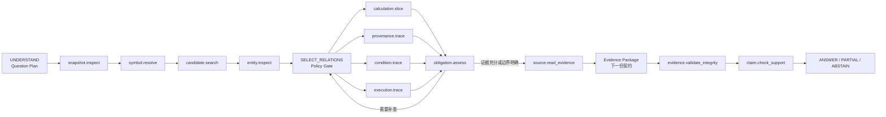

# Agent 调查工具契约

> 核心判断：Agent 的能力边界应由工具契约决定，而不是由 Prompt 决定。LLM 可以选择下一步调查动作，但所有代码事实必须由只读、版本化、受权限和预算约束的领域工具返回；Agent 不获得原始 Cypher、向量库、SQL、Shell 或任意文件读取能力。

状态：`Target architecture proposal — deferred behind POC`
当前轻量实现见：[可演示 POC](./09-demonstrable-poc.md)  
版本：`v0.1`  
日期：2026-08-29  
上游输入：[问题分类与调查策略矩阵](./06-question-investigation-matrix.md)、[统一 IR 与关系 Schema](./07-unified-ir-and-relations.md)  
下游输入：Evidence Package 契约、LangGraph 状态实现、M4 调查工具实现与评测

## 1. 这份契约解决什么

统一 IR 已经定义了系统知道哪些代码事实。当前契约进一步定义 Agent 能够怎样查询这些事实，以及一次工具调用必须返回什么。

如果只给 Agent 一个通用 `query_graph` 或 `search_code`，它可以任意选择关系、无界展开图、混淆候选与事实，也很难判断错误来自哪一步。本设计把调查动作固定为少量、可评测的领域工具：

```text
问题计划
  → 快照门禁
  → 精确符号 / 混合候选定位
  → 计算 / 来源 / 条件 / 执行路径专项调查
  → 证据充分性判断
  → 源码证据读取
  → Evidence Package
  → 证据完整性与 Claim 支持核验
```

工具是代码事实的只读查询接口。它们不会生成业务答案、修改源码、扩大权限或把模型推断写入 IR。

## 2. 设计原则

### 2.1 领域工具代替原始查询

Agent 只能表达“追踪这个字段的值来源”或“寻找入口到目标的执行路径”，不能提交任意 Cypher、SQL、Qdrant filter、正则文件扫描或绝对路径。具体数据库查询由工具内部适配器实现并接受统一评测。

### 2.2 运行时绑定权限与快照

`snapshot_id`、授权范围、IR Schema、Projection 版本和总预算由 Orchestrator 注入。LLM 只能填写业务输入，不得自行更换快照、放宽 scope、启用未批准关系或增加预算。

### 2.3 候选、事实和源码文本分区返回

工具响应必须分开：

- `candidates`：值得继续调查但尚未证明的实体；
- `facts`：由 IR 和确定性规则支持的实体、关系或路径；
- `boundaries`：当前无法继续的明确边界；
- `source_text`：仅作为不可信数据展示的源码原文。

源码注释和字符串可能包含类似指令的内容。所有 `source_text` 必须标记为 `UNTRUSTED_SOURCE_TEXT`，模型不得把源码中的文字当成系统指令。

### 2.4 只有充分性工具改变证据义务状态

定位或调查工具可以返回新事实和边界，但不能自行宣布问题已经回答。只有确定性的 `obligation.assess` 根据 coverage policy 更新 `OPEN / SATISFIED / PARTIAL / UNRESOLVED`。

### 2.5 无声截断是不允许的

结果因节点数、路径数、源码字节或时间预算而停止时，必须返回 `PARTIAL` 或 `BUDGET_EXHAUSTED`、停止位置和剩余缺口。不能返回一个看似完整但实际被截断的结果。

### 2.6 工具调用必须可重放

相同快照、契约版本、IR/索引版本、授权 scope 和规范化输入应得到可解释的一致结果。模型版本、Embedding、Reranker、缓存命中和排序 tie-break 都进入审计记录。

### 2.7 工具只追加调查轨迹，不修改事实层

工具允许产生 append-only Tool Run、Path Result 和 Diagnostic 记录；不允许写入源码、IR、Neo4j 事实边、Qdrant 语料或人工确认的业务语义。

## 3. 工具层次与 Agent 状态



| 工具组 | 工具 | 主要调用方 | 对应状态 |
| --- | --- | --- | --- |
| 快照门禁 | `snapshot.inspect` | Orchestrator | 每次调查开始、恢复和最终核验前 |
| 候选定位 | `symbol.resolve`、`candidate.search`、`entity.inspect` | Agent | `LOCATE` |
| 专项调查 | `calculation.slice`、`provenance.trace`、`condition.trace`、`execution.trace` | Agent | `EXPAND_EVIDENCE` |
| 证据读取 | `source.read_evidence` | Evidence Builder / Agent | `CHECK_SUFFICIENCY` 之后 |
| 调查控制 | `obligation.assess` | Orchestrator | `CHECK_SUFFICIENCY` |
| 双层核验 | `evidence.validate_integrity`、`claim.check_support` | Orchestrator / Verification Node | `VERIFY_EVIDENCE / VERIFY_CLAIMS` |

Question Planner 和 Answer Composer 是受约束模型节点，不属于代码事实工具。关系白名单选择由 Policy Gate 校验，也不开放成任意工具调用。

## 4. 工具注册表

每个工具在 Registry 中声明：

| 字段 | 说明 |
| --- | --- |
| `tool_name` | 稳定命名空间名称 |
| `contract_version` | 请求与响应 Schema 版本 |
| `read_only` | MVP 必须为 true |
| `allowed_callers` | Orchestrator、Agent、Evidence Builder 或 Verification Node |
| `question_types` | 允许服务的原子问题类型 |
| `obligation_kinds` | 可能提供证据的义务类型 |
| `required_capabilities` | 依赖的 IR Manifest capability |
| `supported_ir_versions` | 能读取的 IR Schema 范围 |
| `default_relation_profile` | 固定关系类型、方向和状态策略 |
| `budget_dimensions` | 该工具实际消耗的预算维度 |
| `result_schema` | 严格 JSON Schema，`additionalProperties=false` |

工具在运行时不满足 capability、Schema 或 Projection 版本要求时，必须返回 `CAPABILITY_UNAVAILABLE` 或 `INVALID_SNAPSHOT`，不能退化为不受约束的文本搜索后假装成功。

## 5. 通用请求信封

LLM 只生成 `input`。其余上下文由 Orchestrator 注入：

```json
{
  "request_id": "req-01J...",
  "tool_name": "provenance.trace",
  "contract_version": "1.0.0",
  "investigation_id": "inv-01J...",
  "question_id": "q-001",
  "runtime_context_ref": "ctx-01J...",
  "idempotency_key": "idem-sha256-...",
  "budget_request": {
    "max_nodes": 120,
    "max_edges": 240,
    "max_depth": 8,
    "max_paths": 20,
    "max_source_bytes": 0,
    "deadline_ms": 4000
  },
  "input": {
    "field_id": "ent-field-net-premium",
    "mode": "VALUE",
    "context": {
      "entry_point_id": "ent-entry-main",
      "target_statement_id": "ent-stmt-write-result"
    },
    "obligation_ids": ["po-input-origin-01"]
  }
}
```

### 5.1 Runtime Context

`runtime_context_ref` 在服务端解析出以下不可由模型修改的内容：

- principal、project、repository 和允许的源码范围；
- 固定 `snapshot_id` 与 Bundle Hash；
- IR Schema、Parser、Dialect Rule、Neo4j Projection 和 Qdrant Collection 版本；
- Question Plan 已批准的 relation policy；
- 调查总预算与当前剩余预算；
- 数据导出、日志和模型使用策略；
- Trace、Correlation 和安全审计上下文。

工具的有效预算是：

```text
effective_budget =
  min(Agent 请求预算, Tool policy 上限, Investigation 剩余预算)
```

LLM 无法通过增加请求值扩大预算。

### 5.2 请求校验

所有工具请求必须执行：

1. JSON Schema 与枚举校验；
2. caller 是否有权调用该工具；
3. entity、result 和 cursor 是否属于当前 investigation 与 snapshot；
4. scope 是否在授权范围内；
5. relation policy 是否为 Question Plan 白名单的子集；
6. 请求预算是否可执行；
7. 同一个 idempotency key 是否与原请求内容一致。

任一安全校验失败都不进入数据库查询。

## 6. 通用响应信封

```json
{
  "tool_run_id": "run-01J...",
  "request_id": "req-01J...",
  "tool_name": "provenance.trace",
  "contract_version": "1.0.0",
  "snapshot_id": "snap-...",
  "status": "PARTIAL",
  "result_ref": "result-01J...",
  "result": {},
  "candidate_refs": [],
  "fact_refs": ["rel-flow-001", "path-value-001"],
  "evidence_refs": ["ev-src-101", "ev-src-102"],
  "boundary_ids": ["ent-boundary-external-call"],
  "diagnostics": [
    {
      "code": "EXTERNAL_PROGRAM_MISSING",
      "severity": "WARNING",
      "safe_message": "值来源在未纳入快照的外部程序处中断。"
    }
  ],
  "budget_usage": {
    "nodes": 48,
    "edges": 71,
    "paths": 3,
    "source_bytes": 0,
    "elapsed_ms": 184
  },
  "progress_effects": {
    "new_fact_count": 7,
    "new_evidence_count": 2,
    "new_boundary_count": 1,
    "narrowed_candidate_count": 0,
    "touched_obligation_ids": ["po-input-origin-01"]
  },
  "next_action_hints": [
    {
      "capability": "ANSWER_WITH_BOUNDARY",
      "reason_code": "EXTERNAL_SOURCE_REQUIRED"
    }
  ],
  "audit_ref": "audit-01J..."
}
```

`result_ref` 指向服务端不可变结果；后续工具优先引用它，而不是让 LLM 复制大型路径对象。`next_action_hints` 只是结构化建议，不能绕过 Orchestrator 的状态和策略校验。

## 7. 统一状态与错误语义

| Status | 语义 | Agent 行为 |
| --- | --- | --- |
| `SUCCEEDED` | 请求完整执行；不代表所有问题义务已满足 | 交给 `obligation.assess` |
| `PARTIAL` | 返回了有效事实，但能力、范围或预算造成已声明缺口 | 保留事实并评估缺口 |
| `NO_MATCH` | 在有效范围内没有匹配结果 | 不重复同一请求；改变假设或形成边界 |
| `AMBIGUOUS` | 存在多个会导向不同答案的候选 | 缩小 scope、并行保留假设或澄清 |
| `BUDGET_EXHAUSTED` | 有效执行被预算停止 | 不静默重试；部分回答或停止 |
| `CAPABILITY_UNAVAILABLE` | 当前 IR/Projection 不支持所需语义 | 形成能力边界 |
| `INVALID_SNAPSHOT` | 快照、Hash、Schema 或 Projection 不一致 | 硬停止，禁止回答代码事实 |
| `POLICY_DENIED` | 调用者、scope、关系或数据访问不获授权 | 硬停止，不向模型泄露目标是否存在 |
| `STALE_REFERENCE` | entity、cursor 或 result_ref 不属于当前快照/调查 | 重新定位，不复用旧证据 |
| `INTERNAL_ERROR` | 系统故障，未产生可依赖结果 | 按运行时重试策略处理；模型不自行循环 |

`NO_MATCH`、`AMBIGUOUS` 和 `PARTIAL` 是正常调查结果，不使用异常堆栈表示。返回给模型的 Diagnostic 只包含安全错误码和必要说明；内部路径、凭证、查询语句和基础设施细节只进入受控运维日志。

## 8. 预算、分页与停止

### 8.1 总预算

Investigation Budget 至少跟踪：

- 工具调用数；
- 总经过时间与 deadline；
- 图节点、边、深度和路径数；
- 候选数量与重排数量；
- 可读取源码字节；
- Evidence Package token；
- 模型调用次数与 token。

具体默认值属于评测配置，不写入业务契约。不同问题类型可以使用不同 profile，但任何 profile 都不能由 LLM 临时放宽。

### 8.2 分页

需要分页时使用 opaque cursor。Cursor 必须绑定：

- snapshot 与 Projection 版本；
- canonical request hash；
- authorization scope；
- relation policy；
- 排序规则和上一页边界；
- 到期时间。

Cursor 不能跨问题、跨用户或跨快照复用。每一页都消耗预算；Agent 不能靠分页绕过 `max_candidates` 或 `max_paths`。

### 8.3 单调进展与停止

Orchestrator 根据 `progress_effects` 和 `obligation.assess` 判断是否继续。满足以下任一条件时停止重复调查：

- 同一 canonical request 的 result hash 已经出现；
- 没有新事实、证据、边界或候选缩小；
- 当前未满足义务所需 capability 不可用；
- 剩余预算不足以执行建议工具；
- 所有义务已 SATISFIED，或未满足部分均已形成明确边界。

定位工具和专项工具不能自行重置 no-progress 计数。

## 9. 关系策略

Question Plan 为每个证据义务生成 relation policy；Tool Runtime 再与工具内置 profile 求交集。

```json
{
  "policy_id": "rp-calculation-v1",
  "question_type": "CALCULATION_EXPLANATION",
  "allowed_relations": [
    "WRITES",
    "READS",
    "FLOWS_TO",
    "PASSES_AS",
    "CONTROL_DEPENDS_ON",
    "CALLS",
    "PERFORMS",
    "LOOKS_UP",
    "SELECTS_FROM"
  ],
  "allowed_directions": {
    "WRITES": "INBOUND_TO_TARGET_FIELD",
    "FLOWS_TO": "BACKWARD",
    "CONTROL_DEPENDS_ON": "OUTBOUND_FROM_AFFECTED_STATEMENT"
  },
  "relation_statuses": ["confirmed"],
  "candidate_edge_policy": "RETURN_SEPARATELY",
  "external_boundary_policy": "STOP_AND_REPORT"
}
```

工具可以返回 `candidate` 和 `unresolved` 关系作为边界或替代路径，但默认不能把它们混入 confirmed path，也不能用它们满足要求 confirmed evidence 的义务。

## 10. 快照与定位工具

### 10.1 `snapshot.inspect`

**调用者**：Orchestrator。每次调查开始、恢复、Evidence Package 构建和最终核验前自动调用。

**输入**：无模型输入；仅使用 Runtime Context。

**返回**：

- Bundle 状态：`COMPLETE / PARTIAL / INVALID`；
- IR Schema、Parser、Dialect Rule 与 Source Map 版本；
- Neo4j/Qdrant Projection 状态及输入 Bundle Hash；
- capability matrix；
- 当前授权 scope 摘要；
- 会影响问题类型的 Diagnostics；
- hard-stop reasons。

**约束**：

- 任一已存在 Projection 与 IR Bundle Hash 不一致即 `INVALID_SNAPSHOT`；
- Projection 缺失或尚未就绪时，快照可保持 `PARTIAL`，依赖该 Projection 的工具返回 `CAPABILITY_UNAVAILABLE`；
- `PARTIAL` 不自动拒答，但必须把受影响 capability 交给 `obligation.assess`；
- 不返回源码内容。

### 10.2 `symbol.resolve`

**目的**：验证用户显式给出的 Program、EntryPoint、Paragraph、Field、Table、File 等源码符号。

**输入**：

```json
{
  "symbols": [
    {
      "raw_text": "WS-NET-PREMIUM",
      "expected_entity_types": ["Field"],
      "scope_hints": {
        "program_id": "ent-program-polprm01",
        "copy_occurrence_id": null
      }
    }
  ],
  "match_mode": "DIALECT_NORMALIZED_EXACT",
  "max_matches_per_symbol": 10
}
```

**逐项返回状态**：

- `UNIQUE`：建立锚定调查种子；
- `MULTIPLE`：返回作用域和定义证据不同的候选；
- `NOT_FOUND`：当前授权范围内没有命中，保留为 unvalidated lexical query；该状态不说明授权范围外是否存在同名实体。

**返回事实**：entity ID、类型、原始名称、qualified name、Program/COPY scope、parse status、definition evidence ref。

**明确不做**：模糊匹配、向量搜索、缩写猜测或业务概念解释。唯一命中的锚点不进入 RRF。

### 10.3 `candidate.search`

**目的**：对没有精确锚点的业务词执行稀疏 + 稠密召回、RRF 和 Reranker。

**输入**：

- 最多三个受控 query variants；
- 目标 entity types；
- Program/File 等 scope hints；
- 已验证 anchor IDs 和需要排除的 entity IDs；
- 请求候选数量，受 Tool Policy 上限约束；
- Search Profile ID；模型不能自定义权重。

**返回**：

- 排序后的 entity candidates；
- 每个候选的 sparse rank、dense rank、RRF rank 和 rerank position；
- representation kind、deterministic text hash 和 source preview ref；
- 规范化 token、缩写展开及其 basis；
- 使用的 Embedding、Reranker 和 Index 版本。

分数与排名只解释“为什么值得继续调查”，不能进入 Evidence Package 作为调用、控制或数据流证明。

**硬约束**：

- anchor IDs 不参与 RRF 和 Reranker；
- 不返回没有 `entity_id` 的游离 Chunk；
- 不执行图扩展；
- 不把 LLM 摘要当成第一版基础语料；
- `NO_MATCH` 后不得用完全相同的 query 重试。

### 10.4 `entity.inspect`

**目的**：在进入图调查前确认候选实体的精确身份和局部结构。

**输入**：一个或多个当前快照 entity IDs，以及固定 `include` 枚举：

- `METADATA`
- `SOURCE_REFS`
- `DIAGNOSTICS`
- `STRUCTURAL_CONTEXT`
- `EXPRESSION_SUMMARY`

**返回**：实体属性、Program/Paragraph/COPY scope、直接 `CONTAINS/DEFINES` 上下文、Expression 摘要、源码引用和相关 Diagnostics。

**明确不做**：任意关系遍历、跨程序路径、源码大段读取或候选排名。`STRUCTURAL_CONTEXT` 只返回固定一层且受 item budget 限制。

## 11. 专项调查工具

四个专项工具共享内部 Graph Investigator，但拥有不同 relation profile、输出 Schema 和完成条件。Agent 不能用计算工具请求调用图的任意关系，也不能用执行路径工具证明数据来源。所有 `branch_assumptions` 都只是缩小调查范围的显式 hypothesis，必须在结果中原样回显；它们本身不是代码事实，不能满足证据义务。

### 11.1 `calculation.slice`

**适用问题**：`CALCULATION_EXPLANATION`。

**输入**：

- 已验证 `target_field_id`，或目标 write/Statement ID；
- 可选 EntryPoint、Paragraph、目标执行位置；
- 已知 branch assumptions；
- 相关 proof obligation IDs；
- bounded graph budget。

**返回**：

- 所有相关 write sites，而不是搜索到的第一处；
- 每个 write 的 normalized Expression ID 与有序输入；
- final、default、overwrite、exception 等 write role；
- 控制条件与 branch outcome；
- 直接和多跳 input lineage refs；
- SQL/File/ControlTable lookup refs；
- `PIC / USAGE / scale / receiving conversion / ROUNDED / ON SIZE ERROR`；
- 未解析操作数、别名、动态调用和外部边界；
- 覆盖状态：`COMPLETE / PARTIAL / AMBIGUOUS`。

**不能宣布 COMPLETE 的情况**：

- final write 不唯一且没有分支区分；
- Expression 存在 unresolved operand；
- 结果可能被后续写入覆盖但未调查；
- 数值转换、舍入或 size-error 语义缺失；
- 输入 lineage 在未知边界中断。

该工具返回计算事实结构，不生成“净保费等于……”等业务语言结论。

### 11.2 `provenance.trace`

**适用问题**：`DATA_PROVENANCE`。

**输入**：

- `field_id`；
- `mode = DEFINITION | VALUE | BOTH`；
- EntryPoint、目标 Statement 或已验证 path context；
- `coverage = ALL_REACHING_DEFINITIONS | ONE_PER_BRANCH | UNTIL_BOUNDARY`；
- branch assumptions 与 obligation IDs。

**返回两类不可混淆的路径**：

1. Definition lineage：`DEFINES / EXPANDS_COPY / REDEFINES / ALIASES_STORAGE_WITH / RENAMES`；
2. Value lineage：反向 `WRITES / FLOWS_TO / PASSES_AS`，以及 SQL、File、ControlTable 或 external boundary。

每条 value path 返回：

- 按顺序排列的 entity 与 relation IDs；
- confirmed/candidate/unresolved 分段；
- via Statement、EntryPoint 和参数 ordinal；
- 条件、别名、数组下标和 reference modification；
- 起点类型：parameter、literal/default、SQL column、file record、control table、runtime config 或 external program；
- path stop reason。

**硬规则**：COPYBOOK 只能成为 Definition lineage 的终点，不能自动成为 Value lineage 的值来源。多个 reaching definitions 必须按分支分别返回。

### 11.3 `condition.trace`

**适用问题**：`CONDITION_IMPACT`。

**输入**：

- 已验证 target action、write Statement 或 result Field；
- 可选 EntryPoint/path context；
- 是否追踪 condition field origins；
- branch/exception coverage policy；
- obligation IDs。

**返回**：

- 直接和嵌套控制条件；
- normalized predicate Expression IDs；
- `CONTROL_DEPENDS_ON` 和 `BRANCHES_TO` 路径；
- true、false、WHEN、OTHER、AT END、INVALID KEY、ON SIZE ERROR 等结果；
- 88 级 ConditionName 及其 values/ranges；
- 条件字段 entity IDs，以及可选 provenance result refs；
- default、else 和 exception branch 是否覆盖；
- 只有文本邻近但无法证明控制依赖的 Diagnostic。

**硬规则**：文本位置、注释或词汇相似不能产生 confirmed condition impact。条件值依赖运行时配置时，工具返回 Boundary，不把当前配置值写死进结论。

### 11.4 `execution.trace`

**适用问题**：`EXECUTION_PATH`。

**模式**：

- `BETWEEN`：已知 start 与 target；
- `FORWARD_FROM_ENTRY`：从入口寻找目标；
- `BACKWARD_TO_ENTRY`：从目标反向寻找可能入口。

**输入**：

- mode；
- start EntryPoint/Program/Paragraph，可按 mode 省略；
- target Program/Paragraph/Statement；
- `path_selection = SHORTEST_CONFIRMED | ALL_BOUNDED | INCLUDE_CANDIDATES`；
- path、depth、SCC 和时间预算；
- obligation IDs。

**返回**：

- confirmed paths 与 candidate paths 分区；
- 有序 `CALLS / PERFORMS / PERFORMS_THRU / GOES_TO / BRANCHES_TO / CONTROL_FLOWS_TO` steps；
- EntryPoint、call site、return/termination 和 branch conditions；
- SCC/递归/循环段，不进行无界展开；
- `reachable / conditionally_reachable / candidate / blocked` path semantics；
- 动态调用候选集、外部程序和 missing source boundaries；
- 截断原因和未搜索空间摘要。

**硬规则**：静态可达不等于生产运行必然执行。`POSSIBLY_CALLS` 不能混入 confirmed path；`PERFORM THRU` 必须保留范围终点。

## 12. 证据与控制工具

### 12.1 `source.read_evidence`

**目的**：读取已经由 IR 或调查结果引用的源码证据，供人类复核和 Evidence Package 使用。

**输入**：

- evidence IDs 或 result ref 中已存在的 evidence selection；
- `view = ORIGINAL | NORMALIZED | BOTH`；
- 每条证据允许的 context before/after；
- 总 source byte 请求。

**返回**：

- repository-relative path，不返回服务器绝对路径；
- 原始 line/column/byte span；
- raw 与 normalized content hash；
- `hash_verified`；
- COPY 指令位置、Copybook 原始位置和展开位置映射；
- `content_type = UNTRUSTED_SOURCE_TEXT` 的源码文本；
- 因权限或预算未返回的显式列表。

**硬约束**：

- 不接受任意 path、glob、行号或文件系统路径；
- 只能读取当前调查已经发现且当前 principal 有权访问的 evidence ID；
- Hash 校验失败立即返回 `INVALID_SNAPSHOT`；
- context 扩展受授权边界与 source byte budget 限制；
- 默认审计不保存完整源码文本，只保存 evidence ID、Hash 和字节数。

### 12.2 `obligation.assess`

**调用者**：Orchestrator；实现必须是确定性规则，不调用 LLM。

**输入**：

- Question Plan 与当前 obligation records；
- 本轮新增 result refs、fact refs、evidence refs 和 Boundary IDs；
- 当前 capability matrix、relation policy 和预算状态。

**返回**：

```json
{
  "sufficiency": "INSUFFICIENT",
  "obligation_updates": [
    {
      "obligation_id": "po-final-write",
      "previous_status": "OPEN",
      "new_status": "SATISFIED",
      "evidence_refs": ["ev-write-01"],
      "reason_code": "UNIQUE_FINAL_WRITE_PER_BRANCH"
    },
    {
      "obligation_id": "po-input-origin",
      "previous_status": "OPEN",
      "new_status": "PARTIAL",
      "evidence_refs": ["ev-flow-01"],
      "boundary_ids": ["ent-boundary-external-call"],
      "reason_code": "LINEAGE_REACHED_EXTERNAL_BOUNDARY"
    }
  ],
  "open_obligation_ids": ["po-rounding-semantics"],
  "next_capabilities": [
    {
      "tool_name": "calculation.slice",
      "reason_code": "ROUNDING_NOT_COVERED"
    }
  ],
  "no_progress": false
}
```

**coverage 语义**：

- `one`：一个 confirmed 证据即可；
- `all`：必须覆盖全部静态候选且没有静默截断；
- `one_per_branch`：每个可达分支至少一项；
- `until_boundary`：追踪到已知来源或明确 Boundary。

Candidate edge 不能满足要求 confirmed relation 的义务。Boundary 可以让义务变为 `PARTIAL/UNRESOLVED`，但不能伪装成 `SATISFIED`。

### 12.3 `evidence.validate_integrity`

**调用者**：Orchestrator；实现是确定性校验器。

**输入**：Evidence selection 或后续 Evidence Package ref、期望 snapshot、entity/relation/path/evidence refs。

**检查**：

- snapshot、IR、Source 与本次调查实际使用的 Projection Manifest 一致；
- entity/relation/path 全部存在且属于当前 scope；
- relation endpoints、status 和 qualifiers 完整；
- source span 与内容 Hash 可重新验证；
- COPY source map 完整；
- result ref 没有跨 investigation 或过期；
- 没有把 candidate/unresolved edge 标成 confirmed；
- 没有 Evidence Package 引用未读取或被截断的源码。

**返回**：`VALID / INVALID / INCOMPLETE`、逐项 check result、失效引用和允许的下一步。`INVALID` 是硬停止，任何模型都不能覆盖。

### 12.4 `claim.check_support`

**调用者**：Verification Node。确定性检查优先，可以使用公司批准的受约束模型辅助语义对齐。

**输入**：

- 结构化 claims；
- claim kind：`code_fact / business_inference / open_question`；
- 显式 evidence IDs 与 proof obligation IDs；
- 适用范围、分支和限定词；
- 已通过的 Evidence Integrity Report。

**逐条返回**：

- `support_status = supported`：证据支持且范围没有扩大；
- `support_status = overstated`：核心方向有证据，但遗漏条件、分支或边界；
- `support_status = unsupported`：证据缺失、冲突或引用错误；
- `kind_validation = valid | mislabeled_inference`：检查业务推断是否被误写成代码事实；
- `boundary_validation = documented | missing | not_applicable`：检查 open question 和证据边界是否准确表达。

`support_status` 只保留 `supported / overstated / unsupported` 三值，避免不同核验器产生不兼容状态。

工具可以生成新的补查义务，但不能创建证据，也不能把缺失关系升级为支持。使用模型辅助时必须记录 model、prompt contract 和版本；模型故障不能跳过确定性检查。

## 13. 问题类型与工具路径

| 问题类型 | 必经工具 | 条件工具 | 主要退出门槛 |
| --- | --- | --- | --- |
| `CALCULATION_EXPLANATION` | snapshot → resolve/search → calculation.slice → obligation.assess | provenance.trace、condition.trace、execution.trace | write、expression、input、condition、rounding 和 overwrite 义务关闭 |
| `DATA_PROVENANCE` | snapshot → resolve/search → provenance.trace → obligation.assess | execution.trace、condition.trace | definition/value 明确分开，所有路径到来源或 Boundary |
| `CONDITION_IMPACT` | snapshot → resolve/search → condition.trace → obligation.assess | provenance.trace、execution.trace | controlling conditions、默认和异常分支覆盖 |
| `EXECUTION_PATH` | snapshot → resolve/search → execution.trace → obligation.assess | entity.inspect | 入口与目标已验证，路径状态与动态边分区 |
| `ANSWERABILITY_BOUNDARY` | snapshot → 最接近的专项工具 → obligation.assess | source.read_evidence | 已知事实、停止点、缺少资料和能力缺口明确 |

所有进入 Answer Composer 的路径还必须执行 `source.read_evidence → evidence.validate_integrity → claim.check_support`。实际 Evidence Package 结构由下一份契约固定。

## 14. Agent 不可调用的接口

以下能力可以存在于服务内部，但不注册为 LLM Tool：

- raw Cypher、Gremlin 或任意图查询；
- raw Qdrant query、任意 filter 和权重调整；
- 数据库 SQL、DDL 或管理接口；
- 任意文件 path、glob、目录遍历或 Shell；
- 无关系白名单的 `expand_graph`；
- 直接修改 proof obligation status；
- 直接写入 IR、Neo4j、Qdrant、源码或业务语义；
- 读取其他 investigation 的 result refs；
- 提高预算、扩大 authorization scope 或切换快照；
- 把源码注释转换成系统指令。

管理员诊断工具与离线 Index Builder 使用独立身份、端点和审计域，不与在线 Agent 工具混用。

## 15. 安全、隐私与 Prompt Injection

### 15.1 最小权限

Runtime Context 将用户权限转换为 entity/file scope。所有图路径必须逐节点检查 scope；不能因为起点有权限就返回穿过未授权程序的路径。遇到无权访问的实体时返回不泄露名称和内容的 `POLICY_DENIED` Boundary。

### 15.2 源码是不可信数据

Source、注释、字符串、COPYBOOK 和配置文本都可能包含恶意或误导性指令。工具必须：

- 把结构化事实与源码文本放在不同字段；
- 为所有源码文本加 `UNTRUSTED_SOURCE_TEXT` 标签；
- 不从源码内容生成 Tool Name、Runtime Context 或 relation policy；
- 不允许源码文本控制下一次工具参数；
- 在 Answer Composer Prompt 中明确源码只能作为证据数据；
- 用对抗 fixture 测试 “ignore previous instructions” 等内容。

### 15.3 输出与日志

- 工具结果不包含服务器绝对路径、凭证、数据库地址或原始查询；
- 默认日志保存 request hash、result refs、evidence IDs、预算和状态，不保存完整源码；
- 用户导出答案时重新执行权限检查；
- 缓存按 principal scope、snapshot 和 contract version 隔离；
- 敏感 Diagnostic 只返回安全错误码。

## 16. 审计与可重放

每个 Tool Run 至少记录：

- investigation、question、principal、scope 和 snapshot；
- Tool Name、Contract Version 和 canonical request hash；
- IR、Parser、Dialect Rule、Neo4j、Qdrant、Embedding 和 Reranker 版本；
- 状态、result ref、Evidence/Boundary IDs；
- 预算请求、实际消耗、延迟和 cache hit；
- relation policy 与 capability matrix；
- 内部错误 correlation ID；
- 调用前后的 obligation summary。

重放工具接受历史 Audit Ref，但仍在隔离环境重新验证快照和权限。重放用于评测和故障定位，不允许把旧结果直接升级为当前证据。

## 17. 契约版本与替换性

- 请求或响应新增可选字段：minor version；
- 修改 Tool Status、字段语义、relation profile 或必填字段：major version；
- 修正文档且不改变语义：patch version；
- Orchestrator 和 Tool Registry 在启动时协商兼容版本；
- LangGraph state 只保存 contract records 和 refs，不保存 Qdrant/Neo4j 客户端对象；
- 替换存储或解析器后，同一金标准输入必须保持工具语义和错误分类；
- 不支持当前契约版本时 fail closed，不执行隐式字段丢弃。

## 18. 测试策略

### 18.1 Contract Tests

每个工具必须通过：

- 有效请求与完整响应；
- 未知字段、错误枚举和超限输入拒绝；
- 错误 snapshot、过期 entity/result/cursor；
- 越权 entity、路径中间节点和 evidence；
- 预算在开始前不足、执行中耗尽和结果截断；
- `NO_MATCH / AMBIGUOUS / PARTIAL` 正常返回；
- candidate 与 confirmed 关系严格分区；
- Diagnostic 和 Boundary 完整；
- 幂等重放与稳定排序；
- 不泄露绝对路径、原始查询和内部异常。

### 18.2 Golden Tool Traces

每个金标准问题除答案和证据外，还标注允许的 Tool Trace：

- 需要调用哪些能力，不强求唯一调用顺序；
- 哪个工具应发现正确入口；
- 哪个专项工具应产生必要关系路径；
- 哪些义务何时关闭；
- 必须出现的 Boundary；
- 禁止调用的工具或关系；
- 预算上限和 no-progress 停止点。

工具评测先于 Agent 回答评测。若手工调用工具仍找不到正确证据，问题属于 M4 调查层，不通过 Prompt 或换回答模型修补。

### 18.3 安全测试

- 源码注释中的 Prompt Injection；
- 跨 scope 路径与侧信道；
- 伪造 snapshot/entity/result/cursor；
- 超长 query、候选和 evidence 列表；
- 重复分页绕过预算；
- Diagnostic 注入与日志泄漏；
- 旧快照 Evidence 混入新回答；
- 直接请求 raw query 或任意文件读取。

## 19. M0 验收门槛

本工具契约通过 M0 评审必须满足：

1. 五类问题都有明确且有限的工具路径；
2. 每个事实型返回都带 snapshot、fact/evidence ref 和 relation status；
3. Agent 无法执行 raw query、扩大权限、提高预算或修改事实；
4. Candidate、confirmed fact、Boundary 和 source text 在 Schema 中分区；
5. 每种正常失败都有稳定 Status、Diagnostic 和停止行为；
6. `obligation.assess` 是唯一证据义务状态裁决者；
7. Snapshot 无效、权限拒绝和 Evidence Hash 失败均 fail closed；
8. 工具结果可重放、可审计并能归因到解析器与索引版本；
9. 工具契约不依赖 LangGraph、Qdrant 或 Neo4j 的内部对象；
10. 下一阶段可以只凭 Tool Result refs 构建最小完整 Evidence Package。

## 20. 已决定与待验证事项

### 已决定

- 使用领域工具，不向 Agent 开放 raw storage/query；
- Runtime Context 绑定 snapshot、权限、relation policy 和预算；
- 定位、专项调查、证据读取、充分性判断和核验职责分离；
- 四类核心问题各有专项调查工具；
- 只有 `obligation.assess` 改变义务状态；
- 源码文本作为不可信数据返回；
- 所有工具只读，事实层不可由 Agent 修改；
- Candidate edge 不能满足 confirmed proof obligation。

### 待实现与私有样本验证

- 每个问题类型的默认 Budget Profile；
- 专项工具内部采用 Neo4j query、内存图算法或混合实现的性能差异；
- BGE-M3/Qwen3 候选数量与 Reranker 截断点；
- DXC 动态调用需要向 `execution.trace` 增加哪些输入 qualifier；
- 大规模 COPY 展开下 `entity.inspect` 的局部结构上限；
- Claim Support Checker 使用纯规则还是公司批准模型辅助；
- 权限系统如何转换为 field/paragraph 级 scope；
- Tool Result Store 的物理格式、生命周期和加密策略。

这些事项可以改变实现和配置，但不能破坏工具职责、状态语义和证据边界。

## 21. 目标架构恢复后的下一步

POC 证明需要完整事实层后，再定义 Evidence Package 契约，固定：

- 一次调查选择哪些 Tool Result、Entity、Relation、Expression、Path 和 Source Evidence；
- 怎样表达最小完整逻辑闭包；
- 怎样按分支组织计算、来源、条件和执行路径；
- 怎样进行 token 预算、去重和源码引用；
- Answer Composer 能看到什么，绝对不能看到什么；
- Evidence Integrity Validator 和 Claim Support Checker 的最终输入结构。

当前不执行本节。当前实现任务是 [可演示 POC](./09-demonstrable-poc.md) 的四工具纵向闭环；Evidence Package 契约恢复后，再进行完整技术栈复核。
