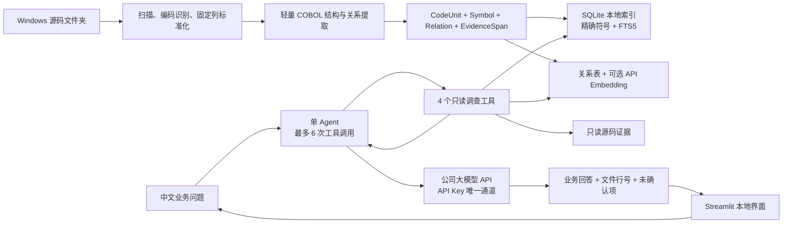

# 可演示 POC：从 Windows 代码文件夹到有证据的业务回答

> 核心判断：第一版不实现完整企业架构，只做一条真实、可复核的纵向闭环——选择一个 Windows 源码文件夹，建立本地索引，用户用中文提问，单个 Agent 调查代码后给出业务回答和精确源码引用。

状态：`Accepted direction / implementation plan proposed`  
日期：2026-08-29  
目标观众：项目发起人、技术领导、业务分析人员  
目标形态：一台 Windows 电脑可运行的只读单机演示

## 1. POC 最终要演示什么

领导看到的不是架构图，而是下面这段五分钟流程：

1. 在界面输入或选择一个 Windows 源码文件夹，例如 `D:\insurance-source\premium`；
2. 点击“建立索引”，界面显示识别出的 Program、Paragraph、Field、COPY、CALL 和 PERFORM 数量；
3. 提问“分期保费最终怎样计算？”；
4. Agent 自动检索候选代码、追踪相关字段和调用，再用业务语言回答；
5. 回答中的每个关键结论都能展开到“相对文件路径 + 行号 + 原始源码”；
6. 再问一个代码无法解释的商业原因，Agent 明确说明源码能证明什么、不能证明什么。

这必须是动态结果：问题不能映射到预写答案；源码副本发生变化并重新索引后，答案和引用必须随代码变化。

## 2. POC 范围

### 必须做到

- 读取一个本地 Windows 文件夹，不修改其中任何文件；
- 支持可配置的 COBOL、COPYBOOK 和相关文本扩展名；
- 按 Program、Section、Paragraph、Data Item 和受控语句窗口组织代码，不做任意 token 切块；
- 建立精确符号和 SQLite 全文检索入口；公司 API 提供 Embedding 时再增加语义向量入口；
- 提取 POC 所需的直接关系：`CALL`、`PERFORM`、`COPY`、字段读写和计算表达式操作数；
- 使用一个有最大步数的 Agent，自主选择下一项代码调查工具；
- 输出业务结论、计算或流程说明、源码证据和不能确认的边界；
- 在 Windows 上用一个启动脚本打开本地聊天界面。

### 明确延后

| 延后能力 | POC 的处理 |
| --- | --- |
| 完整 DXC Smart COBOL 语义 | 只支持通用 COBOL 和可配置的少量模式；未知语法显式标记 |
| 完整编译器级 AST/ASG | 使用容错的轻量结构提取器 |
| Neo4j 代码图 | 关系保存在 SQLite，并以内存邻接表做最多三跳调查 |
| 独立向量或检索服务 | 使用 Python 自带 SQLite；可选 Embedding 也保存在本地 SQLite，不启动后台服务 |
| 完整统一 IR | 只保留四个稳定对象：CodeUnit、Symbol、Relation、EvidenceSpan |
| 12 个企业级 Agent 工具 | POC 只暴露 4 个只读工具 |
| LangGraph 工作流 | 使用普通 Python 实现单 Agent 有界工具循环 |
| 多用户权限、SSO、审计平台 | 单机、单用户、只读；保留基础运行日志 |
| 完整依赖失效系统 | POC 按文件 Hash 跳过未变化文件，只重建变化文件和直接关系 |
| 正式 Evidence Package 双层核验 | 先做轻量引用校验和回答约束 |
| 文档 RAG、付费 DXC 文档 | POC 只依据源码回答 |

这些能力不是被否定，而是不允许阻塞第一次演示。

## 3. 最小架构



整个 POC 是一个 Python 进程，使用 Python 自带的 SQLite 保存文件、符号、FTS5 全文索引、关系和源码证据，不需要安装数据库或模型服务。启动时检查 FTS5；若公司 Python 未启用该能力，则退回纯 Python BM25。若公司 API 提供并批准 Embedding 接口，索引阶段调用该接口并把向量保存在 SQLite；否则只使用精确符号与词汇检索。

## 4. 文件接入与轻量代码理解

### 4.1 输入假设

首版假设 Windows 文件夹中是可读取的文本源码。默认尝试 UTF-8、UTF-16、CP950/Big5 和常见单字节编码；如果来源仍是 EBCDIC 二进制成员，先由独立导出步骤转换为文本，这不在 POC 内自动完成。

扩展名由配置决定，初始建议覆盖：

```text
.cbl .cob .cobol .cpy .copy .pco .sqb .txt
```

### 4.2 结构提取

轻量提取器使用状态机和受控语法模式识别：

- `IDENTIFICATION / ENVIRONMENT / DATA / PROCEDURE DIVISION`；
- Section、Paragraph 和 Entry；
- Data Item、PIC、USAGE、88 级和 COPY；
- `CALL / PERFORM / PERFORM THRU / GO TO`；
- `MOVE / COMPUTE / ADD / SUBTRACT / MULTIPLY / DIVIDE`；
- `IF / ELSE / EVALUATE / WHEN`；
- EXEC SQL 块、文件操作和无法解析的外部边界。

POC 不声称获得完整控制流和数据流。能够确定的关系标记为 `confirmed`；动态调用、复杂 REDEFINES、COPY REPLACING 和企业方言无法确认时标记为 `unresolved`，回答不得把它们描述成已证明事实。

### 4.3 四个最小对象

| 对象 | POC 必要字段 |
| --- | --- |
| `CodeUnit` | unit_id、类型、Program/Paragraph、检索文本、文件和行号 |
| `Symbol` | symbol_id、名称、类型、定义位置和 scope |
| `Relation` | from、type、to、状态和证据位置 |
| `EvidenceSpan` | 相对路径、起止行、源码 Hash 和可显示文本 |

这些对象足以完成演示，也能在后续无损映射到完整统一 IR。

### 4.4 数千程序的分层索引

POC 接受全部已下载 COBOL 和 COPYBOOK，而不是先人工复制 5–30 个文件。为了避免全库深解析拖垮首次演示，索引分四层：

| 层级 | 覆盖范围 | 处理内容 | 是否调用公司 API |
| --- | --- | --- | --- |
| `L0 Inventory` | 全部文件 | Hash、大小、编码、扩展名、Program-ID、COPY/CALL/PERFORM/SQL 计数和重复名 | 否 |
| `L1 Structural` | 全部文件 | Program、Section、Paragraph、Data Item、COPY、字面量 CALL、PERFORM 和源码行号；建立 SQLite FTS5 | 否 |
| `L2 Semantic Retrieval` | 全部 Program/Paragraph 或受控范围 | 仅在公司批准 Embedding API 后批量生成向量；结果本地缓存并按内容 Hash 复用 | 可选 |
| `L3 Deep Analysis` | 本次问题命中的候选程序及其直接依赖 | 计算操作数、字段读写、条件和最多三跳关系；按需建立，不预先扫描所有 Statement | 只有最终调查和回答调用 Chat API |

L0/L1 必须能够中断后重跑，并按文件 Hash 跳过未变化文件。索引阶段不生成 LLM 代码摘要；Embedding 只用于候选召回，不成为代码事实。领导演示前只预热被选业务流程的 L3 结果，但搜索范围仍是完整下载快照。

## 5. 检索不是纯向量搜索

每个问题采用固定的轻量顺序：

```text
问题中的显式程序/字段名精确匹配
  + SQLite FTS5 全文检索
  + 可选的公司 Embedding API 向量检索
  → 按稳定秩融合并保留前 10 个候选
  → 沿 CALL / PERFORM / READS / WRITES 最多扩展 3 跳
  → 读取必要源码行
  → 生成带证据回答
```

精确命中的符号永远优先。向量相似度只负责找到可能相关的代码，不允许单独证明“字段来自哪里”或“某程序一定被调用”。

首版不使用 Reranker。只有金标准问题证明 Top-10 噪声显著影响答案，而且公司 API 提供获准的重排能力时才启用；不安装本地重排模型。

## 6. 一个真正但受控的 Agent

POC 只给模型四个工具：

| 工具 | 作用 |
| --- | --- |
| `search_code` | 精确符号 + 全文 + 可选 API 向量查找候选 CodeUnit |
| `inspect_symbol` | 查看一个符号的定义、直接读写和直接调用关系 |
| `trace_relations` | 沿批准的关系类型做最多三跳追踪 |
| `read_evidence` | 读取已经发现的 EvidenceSpan，不接受任意文件路径 |

Agent 每个问题最多调用 6 次工具；连续两次没有发现新实体或证据就停止。模型不能执行 Shell、任意文件读取、数据库查询或修改源码。

这仍然是真 Agent：模型根据当前证据决定下一步搜索字段、检查符号还是追踪关系；只是它的行动范围小、成本可预测，而且失败时能够解释。

## 7. 回答格式

回答固定为四段：

1. **结论**：直接回答业务问题；
2. **代码怎样实现**：按计算或执行顺序解释；
3. **源码依据**：列出相对文件、Program/Paragraph、行号和关键代码；
4. **不能确认**：列出动态调用、外部表、运行数据或私有 DXC 语义造成的边界。

每个事实性句子必须关联至少一个 EvidenceSpan。没有证据时只能作为“可能的业务含义”或“需要确认”，不能补全成事实。

## 8. Windows 运行与模型边界

交付物提供 `run_poc.bat`，启动本地聊天界面。Streamlit 作为应用内部依赖随 POC 环境交付，不安装后台服务；其标准聊天组件适合快速演示，见 [Streamlit Chat Elements](https://docs.streamlit.io/develop/api-reference/chat)。若公司电脑禁止 `pip install`，则在获准构建环境中打包成便携式 Windows 应用目录，用户无需管理员权限安装软件。

大模型只有一个允许通道：公司提供的 API。POC 不安装 Ollama、其他本地模型运行时或模型文件。

运行时只配置以下信息：

- `COMPANY_API_BASE_URL`：公司 API 地址；
- `COMPANY_API_KEY`：只从 Windows 环境变量或当前 UI Session 读取；
- `COMPANY_CHAT_MODEL`：公司批准的聊天模型；
- `COMPANY_EMBEDDING_MODEL`：可选且默认关闭；只有公司允许批量源码调用 Embedding 时才启用；
- `COMPANY_API_STYLE`：默认 `openai_compatible`，非兼容接口通过一个小型 Adapter 转换。

OpenAI-compatible Adapter 以 `POST /v1/chat/completions` 为首版基线，并在启动时分别探测普通 Chat、`tools/tool_choice/tool_calls`、严格 JSON 和可选 `POST /v1/embeddings`；不能因为“兼容 OpenAI”就假定所有能力都存在。Chat Completions 的工具字段结构参考 [OpenAI 官方 API 文档](https://developers.openai.com/api/reference/cli/resources/chat/subresources/completions)。

公司 API 支持原生 Tool Calling 时，Agent 直接使用；如果只支持普通 Chat Completion，模型返回严格的 `action + arguments` JSON，由应用校验后执行同样的四个工具。API Key 不写入项目文件、SQLite、Prompt、日志或错误信息。源码仍先在本地检索，每轮只把当前问题所需的少量证据片段发送给公司 API。

## 9. 演示语料与问题

POC 对全部已下载 COBOL/COPYBOOK 建立 L0/L1 索引，保证搜索和跨程序入口发现不被人工文件选择截断；但回答正确性只对一个经过人工标注的业务流程作承诺。该流程可以从少量种子程序开始，实际调查允许沿 COPY、CALL 和 PERFORM 进入全库其他文件。

当前源码快照只包含 COBOL 与 COPYBOOK。DDL/DDS、Job Schedule、DB File 定义与数据、Item/Control Table 内容、运行参数和生产日志都不在快照中。Agent 可以从 EXEC SQL、SELECT/FD 和调用代码识别外部对象名称，但不能证明其字段定义、调度时间、生产值或商业配置。每个回答必须显示“已索引制品”和“缺失制品”覆盖说明。

演示至少包含六个问题：

1. 一个完整计算问题；
2. 一个输入字段或费率来源问题；
3. 一个条件分支问题；
4. 一个跨 Program/PERFORM 执行路径问题；
5. 一个演示前没有写入脚本的自然语言问题；
6. 一个源码无法回答的商业原因问题。

公开开发先使用现有合成保费场景中的 `CALC-01` 建立闭环；进入公司环境后，把同一接口连接到获准的 Windows 试点文件夹，不复制真实源码到本项目。

## 10. POC 验收门槛

| 维度 | 通过条件 |
| --- | --- |
| 可运行 | 新 Windows 环境按说明可以启动界面、输入文件夹并完成索引 |
| 真实性 | 删除预生成答案后仍能回答；源码副本变化并重建后答案和引用随之变化 |
| 可追溯 | 每个代码事实能打开到真实相对文件和行号，不出现虚构实体 |
| 业务效果 | 4 个已标注问题均得到业务人员认可的核心结论和必要证据 |
| 泛化 | 1 个未预写问题能找到相关代码，或诚实说明缺口 |
| 拒答 | 1 个商业原因或缺少运行数据的问题不被模型猜测回答 |
| 规模 | 全部下载文件完成 L0/L1，支持断点重跑并按 Hash 跳过未变化文件 |
| 体验 | 首次全库索引时间由真实画像后确定；预热业务流程的单问目标不超过 30 秒 |
| 隐私 | 只读源码；只向公司 API 发送最小必要证据；API Key 不落盘、不入日志、不进入 Prompt |

性能目标只约束已下载源码快照和预热演示流程，不代表 AS400 全系统 SLA。

## 11. 十至十五个工作日实施里程碑

以一名工程师和一名兼职业务复核者为基准；首次 L0 画像完成后再锁定最终日期：

| 里程碑 | 时间目标 | 可见结果 |
| --- | --- | --- |
| `P0` API 与全库画像 | 第 1–2 天 | 验证公司 API 能力；离线统计全部文件、编码、Program/COPY/CALL/PERFORM/SQL 和重复名 |
| `P1` 全库粗索引 | 第 4 天 | 全部下载源码完成 L1、SQLite FTS5、符号和直接关系，并支持 Hash 复用 |
| `P2` 业务流程深分析 | 第 8 天 | 四个工具能按需完成一个计算流程的字段、条件和调用追踪 |
| `P3` Agent 可对话 | 第 11 天 | 公司 API、6 步工具循环、回答、源码引用和覆盖边界 |
| `P4` 领导演示版 | 第 15 天 | 六问演练、一个实时未预写问题、安装脚本和演示说明 |

如果真实 DXC 语法导致关键结构完全无法识别，P2 不扩大成完整解析器项目；先为当前试点加入一条可测试的方言规则，并把未覆盖部分明确展示。

## 12. 与目标架构的关系

POC 不是推翻现有设计，而是把它压缩成可验证的前导切片：

| POC | 验证成功后的演进 |
| --- | --- |
| SQLite FTS5 + 可选公司 API Embedding | 根据真实规模再决定是否需要企业检索服务 |
| SQLite 关系表与内存三跳 | 版本化统一 IR + 公司批准的图服务（如确有必要） |
| 4 个只读工具 | 完整 Agent 工具契约 |
| Python 6 步循环 | LangGraph 可恢复状态机 |
| 轻量引用校验 | Evidence Package + 双层核验 |
| 单机单用户 | 权限、审计、增量索引和正式公司 API 接入治理 |

只有 POC 的真实问题暴露出需要这些能力时，才逐项升级。下一阶段的设计和代码评审都以“是否直接提高这次演示闭环”为准。

## 13. 当前实现状态

已经实现完全离线、不会调用公司 API 的 [`repo_inventory`](../poc/README.md)：

```text
Windows COBOL/COPYBOOK 文件夹
  → 递归扫描与编码识别
  → 文件 Hash 与快照 ID
  → Program-ID / COPY / CALL / PERFORM / EXEC SQL 统计
  → 重复程序、重复 COPYBOOK、动态 CALL 和无法解码清单
  → 只含聚合数据的 JSON/Markdown 画像报告
```

P1-A 结构索引与 P1-B 四个只读调查工具也已完成。原创 CALC-01 fixture 包含 13 个 COBOL/COPYBOOK 文件，当前索引产生 261 个 CodeUnit、104 个 Symbol、416 条 Relation 和 241 个 EvidenceSpan；六步离线演示读取 12 段通过 Hash 校验的源码证据，返回 `SUPPORTED_WITH_BOUNDARIES`。

P3-A 可运行骨架已于 2026-08-31 完成：公司 OpenAI-compatible API capability probe 会验证 Chat、Tool Calling 回传和严格 JSON；运行器根据结果选择原生工具或本地校验 JSON fallback。Agent 最多调用 6 次四个只读工具，两次无进展后停止，并强制快照、Evidence 范围、Hash 和引用校验。CALC-01 在 4 次真实工具调用内完成离线闭环，两类越过源码证据的问题会拒答，当前 70 项自动测试全部通过。

下一步是在公司批准环境对真实 API 执行 capability probe 和 CALC-01 验收，并增加独立 Claim 语义支持核验。现有完整性与词面锚定不能证明任意自然语言 claim 的语义，所以 Agent 暂时最高返回 `PARTIAL`。用户仍需在公司允许的本地环境运行真实下载目录画像；真实源码、文件内容、程序名称和 API Key 不进入本项目或外部对话。详见 [P3-A 项目进度报告](./reports/2026-08-31-p3a-progress-report.md)。
