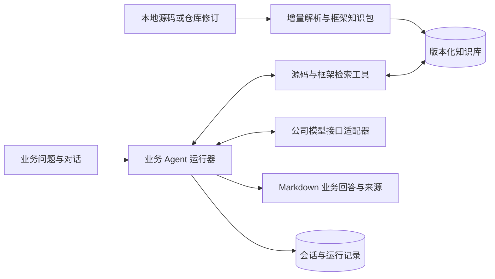

# 从本地业务分析原型走向可持续使用的 Agent

日期：2026-09-29。状态：产品化设计提案；本轮改动与后续目标分开列示。关联决策：[ADR-0010](./adr/0010-business-agent-productization.md)。

**当前的第一任务是让业务回答准确、有用，而不是继续扩建技术栈。已有真实源码检索、结构索引和多轮问答，但真实业务质量仍未验收，所以暂时仍按本地原型管理。下一阶段先提高问题定位、关键规则覆盖、Smart COBOL 框架理解和连续追问效果，之后才推进远程仓库和 coding agent。** 换目录名、安装 LangChain 或增加数据库数量都不是完成产品化的判据。

第一使用者是业务分析师。用户提出任意业务问题后，系统要找到相关实现、理解框架约定与当前调用的结合方式，并解释业务规则、适用条件、计算口径、例外及变更影响。问题不限于预置业务主题；默认回答是可继续追问的业务知识，源码在引用中按需展开。真实作业间调度依旧保留为后续选项。

## 1. 第一阶段以业务回答质量为结果

公司已有成熟保密环境，本轮不把新增安全功能作为开发主线。当前沿用既有部署和数据范围，不新增外发目的地；收费调用仍须先取得同意。数据库、索引与 Agent 框架只在能改善下列结果时优先改动。

| 顺序 | 要改善的能力 | 具体开发方向 | 如何判断有效 |
| --- | --- | --- | --- |
| 1 | 从业务问题找到正确实现 | 结合会话对象、精确标识、业务描述与框架术语定位，模型可补搜新的源码词 | 相关实现检索率提高，陌生问题也能命中 |
| 2 | 读到完整计算与条件 | 将计算、输入来源、条件分支、参数定义和相关调用组成上下文，避免只读命中词附近 | 关键规则遗漏率下降，不漏决定结果的分支 |
| 3 | 理解 Smart COBOL 的动作 | 把实际操作码、USING 参数、copybook 布局、返回后处理与手册章节对应 | 框架动作解释正确，关键结论有对应来源 |
| 4 | 围绕业务问题持续调查 | 追问保留业务对象与原来的分支，缺什么补查什么，允许切换主题 | 多轮承接准确，BA 能继续追问并获得有用答案 |

优先记录检索率、关键规则遗漏率、引用支持率和业务可用性，同时记录回答耗时和费用。LangGraph、存储迁移、完整检查点等属于支撑工程，不排在这四项前，也不作为质量通过的替代物。

### 已有、本轮改动与后续建设

| 能力 | 已有实现 | 本轮落地范围 | 后续建设 |
| --- | --- | --- | --- |
| 业务问答 | 先检索；模型可继续请求搜索或按行阅读；保存多轮对话；最终 Markdown 回答 | 抽出运行策略配置，增加主动检索框架资料的工具 | 优先评测并改善业务定位、上下文完整和追问效果；恢复能力随后推进 |
| 框架理解 | 私有 Markdown/文本资料按问题与源码匹配进入上下文 | `framework_search` 支持模型根据发现补查手册 | 动作、参数、调用条件与手册对应；逐步形成可版本化知识包 |
| 本地代码库 | 目录缓存、增量结构索引、SQLite FTS5/BM25、CALL/COPY 关系、业务规则候选 | 深部命中优先提供所属程序、入口和父段完整范围，支持补读条件；复用已有索引 | 进一步改善计算、条件和参数的上下文组装；统一来源接口随后推进 |
| 存储与资源 | 索引和对话主要在 SQLite；部分 JSON 承担控制与快照恢复职责 | 有界缓存和会话读取；原始 API 响应诊断改为明确选择后启用 | 统一迁移、保留策略、团队 PostgreSQL、容量监测 |
| 语义检索与编排库 | 默认路径没有部署 embeddings、向量库或 LangChain/LangGraph | 本轮不偷偷引入收费模型或云组件 | 在对照评测后选择语义召回和 LangGraph 适配 |
| 公司环境验收 | 已有合成程序、模拟接口与本机性能记录 | 运行离线回归，记录真实完成内容 | 用户批准费用后测试真实接口、真实业务问题及 Windows 环境 |

“本轮落地范围”是这次开发的交付范围，不表示后文全部目标已实现；完成情况以代码审查和本轮测试记录为准。上次性能与界面验收见[验收记录](./17-import-and-business-answer-verification.md)，早期实现差距见[当前实现说明](./16-current-implementation-status.md)。这些记录有各自日期，不能用旧测试数量代替本轮结果。

## 2. 为什么已有 RAG，仍需要改进

RAG 是“检索外部知识后辅助生成”，不要求向量库，更不要求某个厂商框架。现有 SQL/全文检索和源码读取进入模型上下文，属于检索增强；LangChain 官方也允许已有 SQL 或文档知识库直接作为 Agent 的工具。Agentic RAG 进一步允许模型在分析中决定何时补查，而不是每个问题执行同一串固定页面分析。[官方 Retrieval 说明](https://docs.langchain.com/oss/python/deepagents/retrieval)

当前应准确称为“全文和结构检索增强的业务 Agent”。这里的结构图包含已经抽取的关系，尚不是覆盖所有 COBOL 方言、动态调用及运行分支的完整程序语义图。源码在索引里分页不等于逐页调用模型：页面是定位和按需传输单位。业务问答应按相关段落、调用点、参数及规则组合上下文；不应为了分析一个问题把整库页面全部送往模型。

本轮修复了一个具体的上下文缺陷：过去每个命中文件的结构目录只取开头 24 项，大程序深处的命中可能没有对应父段可导航。现在同样保持有界目录，但优先选择命中位置所属的程序、入口、Section/Paragraph，给出完整行范围并区分是否已提供完整原文。离线回归验证：45 个前置段落后的命中可以继续读回开头的 IF 条件和 END-IF；多程序文件也能取回当前程序自己的入口。它改善补读依据，不表示模型已经自动读完所有分支；这部分仍须在真实问答中评价。

长链问题采用两种互补方式：对于“哪些程序使用指定表或字段”，先确定性查询精确标识和可枚举关系，分页汇总全部命中；对于“这个业务怎样计算”，先定位关键计算与条件，再沿其输入、调用者、被调用者补读。不能用语义检索的 top-k 结果声称已列出全库全部影响对象。GitHub 等成熟代码检索仍保留精确字符、正则、路径和解析器符号搜索；其符号支持列表未列出 COBOL，不能假设接入通用平台就得到本项目的框架语义。[GitHub Code Search](https://docs.github.com/en/search-github/github-code-search/understanding-github-code-search-syntax)

## 3. 可执行的真实业务问答验收

状态：**计划尚未执行真实模型调用，费用待用户批准。** 离线准备题库、标注来源和检索测试可以先完成；模拟回答仅验证接口与页面，不能计入业务质量分。

### 测试集与金标准

由熟悉系统的 BA 和开发人员从实际工作中各自提出问题，整理 20 个场景，每类 4 个；每类随机保留 2 个开发场景和 2 个独立验收场景。独立集的题目和答案不用于修改 Prompt、特判或检索词表。发现独立集失败可以记录原因；用它调参之后就应补充新的独立场景再验收，不能继续把已见题当泛化成绩。

| 任务类型 | 问法特征 | 金标准标什么 |
| --- | --- | --- |
| 业务规则与计算 | 自然业务名称，不一定带程序名；询问金额、资格、状态等如何得出 | 必须说明的规则、输入来源、计算顺序、决定性条件、例外及对应源码位置 |
| 流程与框架动作 | 询问某动作经过哪些处理、框架接口做什么，含只有调用关系的外部程序 | 实际调用链、操作码、参数布局、手册章节、返回后分支；哪些内部行为不能从现有资料得出 |
| 配置或属性变更影响 | 给定表、字段、参数或业务属性，询问影响对象及业务后果 | 直接命中对象、需继续追踪的关系和已知间接影响；枚举范围与遗漏对象 |
| 数据来源与异常处理 | 询问一个结果从哪来，为什么被拒绝或走另一条分支 | 字段赋值链、状态判定、错误/返回处理、业务后果和完整条件 |
| 多轮业务调查 | 首问定位，追问改变条件/指出另一场景，再切换主题 | 各轮承接的业务对象、应保留/更新的条件、需补查资料与每轮应回答要点 |

这五类是能力分类，不限定任何具体业务主题。样本交叉覆盖长调用链、大程序尾部规则、过程 COPY、非英文业务表达、递归/重复调用，以及部分被调用程序没有源码的情况。每个场景固定源码和框架资料修订，记录 `case_id`、问题/追问、相关程序与段落、必须回答的业务要点、关键/一般级别、引用位置、人工预期业务解释；不要求模型逐字复述标准答案。

BA 确定“哪些信息才对使用者有用”，开发人员核对源码、条件和框架对应。两者有分歧先检查资料，再形成金标准；不能把某一位评审记忆中的业务规则直接当源码事实。已有预写演示例题只作开发回归，不进入独立验收成绩。

### 执行顺序和费用边界

1. **离线定位。** 对 20 个场景运行现有本地检索，记录初始候选、结构扩展和实际可送入模型的代码/框架片段。先修索引缺项、错范围、条件被截断等不需模型的错误。
2. **批准小样本试验。** 从开发集每类取 1 个场景，先列明总用户轮数、每轮最多模型请求数、输入/输出 Token 上限、重试规则、模型单价及整批费用上限，取得用户同意后再运行。多轮场景每次追问都计入轮数；预算包括失败调用。当前价格未知，不能在文档中给出虚构金额。
3. **冻结候选版本。** 修复小样本发现的问题后，固定代码、运行策略、模型配置、源码与手册修订。其他开发场景可用于确认，但若超出已批准费用，重新取得授权。
4. **独立验收。** 以随机次序运行 10 个未用于调优的场景；评审不先看到版本标签。与冻结的旧版本对照需要额外模型调用，同样必须包含在批准的费用内。没有旧版本真实成绩时，只报告本轮绝对成绩，不把模拟旧答案拿来制造提升。
5. **复盘。** 按下表和失败归因逐题交付，指出先改检索、框架理解、上下文还是生成；不因整体均分好看而隐藏一个严重错误答案。

费用上界按各调用上限求和：输入 Token 上限×每 Token 输入单价＋输出 Token 上限×每 Token 输出单价，另计供应商规定费用。若无法可靠估算 Token，应采用更保守上限或更小批次；发生授权外调用需求即结束当前批次，保留已完成结果。文档本身、`.env` 有配置和运行次数限制均不构成消费授权。

### 评分与第一批候选通过标准

下列阈值是建议的第一批验收目标，需在收费试验前由产品负责人确认；并非当前系统已经达到的成绩。小样本同时报告分子/分母和每题结果，不只报百分比。

| 指标 | 计算方式 | 建议目标 |
| --- | --- | --- |
| 相关实现检索率 | 初始候选和多轮检索分别计算：找回的金标准代码单元/章节数 ÷ 金标准必需单元/章节数；注明候选数量 | 最终检索总体 ≥90%，各任务类 ≥80%；精确标识的已知直接对象不得遗漏 |
| 上下文完整率 | 实际发送给模型的材料中，已同时包含计算/动作及其必要条件、参数和来源的关键要点数 ÷ 全部关键要点数 | ≥90%；与“检索已找到但没送入”的情况分开统计 |
| 关键规则遗漏率 | 最终答案遗漏的金标准关键业务要点数 ÷ 全部关键要点数 | ≤10%；单题出现颠倒金额、条件或动作含义的严重错误不通过 |
| 引用支持率 | 至少有一处来源确实支持的关键结论数 ÷ 所有需要来源支撑的关键结论数 | ≥95%；引用 ID 存在但内容无关按不支持计算 |
| 业务可用性 | BA 逐题 1–5 分：1=错误/无用，2=大量缺项，3=需明显补查，4=可用且只有次要缺项，5=清楚完整且可继续工作 | 均分 ≥4，且至少 80% 场景达到 4；不以代码数量评分 |
| 多轮正确承接 | 正确保留业务对象及条件、按追问更新分析的轮次 ÷ 总追问轮次 | ≥90%；话题切换后不得继续套旧对象 |
| 时间与费用 | 每轮本地检索、首个输出、总回答、请求次数、输入/输出 Token、计费金额 | 先报告真实分布和最慢案例；满足批准费用上限，再与旧版本对比速度 |

首批少于 20 个完整场景时以数量和最大值展示耗时，避免用不稳定的 P95 包装成绩；样本增加后再稳定统计延迟分布。任何“回答速度提升”必须同时查看质量，不能靠遗漏必要条件或提前结束调查换取漂亮时间。

### 失败归因

| 发现 | 归因 | 下一步 |
| --- | --- | --- |
| 金标准资料在源码库，但索引没有对应单元/关系 | 索引或解析失败 | 修解析、COPY/框架关系提取；无需先换模型 |
| 索引有资料，实际检索未找到 | 定位/召回失败 | 改查询扩展、精确标识、业务术语或结构扩展；再评估是否需要语义召回 |
| 已检索到，最终上下文遗漏关键条件/参数 | 上下文组装失败 | 调整单元边界和材料取舍，补读相关分支；不一律扩大窗口 |
| 源码和手册都已送入，但操作码/参数对应错误 | 框架解释失败 | 检查传参映射和资料匹配，增加有区分度的反例 |
| 必要材料完整，答案仍推理错误或不回答问题 | 模型/任务说明失败 | 改分析指令或候选模型；追加真实对照调用另获费用批准 |
| 首答正确，追问丢业务对象或套用旧条件 | 多轮调查失败 | 修相关历史选择、引用恢复和追问检索 |
| 超时、认证失败、无模型输出 | 运行/接口失败 | 单独计为不可用，不伪装成低质量答案，也不从整体失败率中删掉 |

通过这份验收确定下一批开发项：如果主要失败是业务词找不到程序，优先改召回；如果材料齐而答案不懂框架，就改框架对应和生成；只有恢复、并发或状态问题实际影响使用时，才把 LangGraph 或存储工程提到前面。

## 4. 目标结构与接口

继续采用模块化单体，将来源接入、知识构建、检索、运行编排和展示划出接口。首次部署不要求同时维护多个数据库服务。

以下是目标接口，名称用于说明职责，不是已全部存在的类或 API：

| 接口 | 输入与输出 | 重要约束 |
| --- | --- | --- |
| `SourceProvider.resolve_revision` | 来源配置、目标分支 → 固定 `revision_id` | 一次调查绑定同一修订；密钥不进入返回值 |
| `SourceProvider.list_changes` | 基础修订、目标修订 → 新增、修改、删除、重命名文件流 | 首次可全量列举；后续增量；分页和取消 |
| `SourceProvider.read_blob` | 修订、相对路径 → 字节流、哈希、编码信息 | 不接受模型任意网络地址或绝对路径 |
| `KnowledgeBuilder.update` | 修订、文件变化、解析器和框架版本 → 知识快照 | 按内容和解析配置复用；构建中快照不冒充已发布快照 |
| `RetrievalService.search` | 快照、问题、精确标识、范围、游标 → 候选和总量信息 | 精确匹配、全文、结构扩展、可选语义召回分别记录来源 |
| `RetrievalService.read_unit` | 快照、代码单元或行范围 → 原文、来源、相邻结构 | 优先完整段落/语句；大段按窗口读取并保留父级结构 |
| `FrameworkService.search` | 知识包修订、问题、调用上下文 → 手册原文和相关契约 | 框架通用说明与当前调用含义分别保存 |
| `AgentRuntime.run/resume` | 问题、会话、知识快照、运行策略 → 事件、回答、用量 | 状态持久化；收费动作需要有效授权；重复工具请求可复用 |

这组边界使日后替换全文引擎、模型供应商、编排库或数据库时，不必重写业务接口。模型可以选择工具和补查方向；文件访问范围、权限与预算由应用执行，不能由模型自报已满足。

## 5. 硬编码应如何处理

| 类型 | 例子 | 处理决定 |
| --- | --- | --- |
| 语言和协议规则 | COBOL 动词、固定格式、CALL/COPY 语法、工具参数类型 | 保留确定性代码与回归；必要时按方言适配。确定性并不等于不智能 |
| 运行默认值 | 检索数量、上下文大小、调用次数、缓存容量 | 归入运行策略，配置可解释、可记录；保留合理默认值，避免散落常数 |
| 私有框架知识 | 分派入口、参数布局、操作码、事务/文件约定、术语 | 外置版本化知识包；公开源码不写公司专有标识 |
| 示例问题特判 | 某几个业务词固定跳转、示例程序名决定答案 | 从默认问答路线移除；夹具只用于测试，不作为生产知识 |
| 示例和离线模拟 | 合成保单、表配置、模拟 API 回答 | 可以保留，但明确隔离，不能冒充真实业务能力 |

运行策略控制的是资源使用，不是把资料不齐转化为整题拒答。回答应先解释已经分析到的业务规律；某个缺失实现确实改变结论时，用贴近问题的一句话说明即可。不能删除来源约束后让系统编造缺失程序的内部行为。

### 本轮运行策略的使用

可将 [`poc/agent-settings.example.json`](../poc/agent-settings.example.json) 复制到项目的 `.poc-data/agent-settings.json`，仅保留要覆盖的 `agent` 字段也可；`version` 保持 `1`。没有该默认文件时使用已有默认值。也可通过启动进程的 `AGENT_SETTINGS_PATH` 环境变量指定文件；当前这个变量不从项目 `.env` 自动读取，模型凭据仍按原有 `.env` 规则加载。

默认每题最多 5 次模型请求、每次源码正文最多 36,000 字符、历史上下文最多 18,000 字符、编码后的请求最多 230,000 字节；每个补查轮次最多 3 项源码搜索、3 处源码读取和 3 项本机框架查询。字符数与请求字节数不是 token 数，也不是费用金额。框架补查不单独调用模型，仍共享每题请求上限；配置不会自动扩大预算或授权消费。当前策略作用于页面默认业务对话和命令行 `retrieval` 路径，旧逐页兼容路径未迁入这一策略。

页面每次提问读取策略，无需为调整策略重新建索引。明确指定的策略文件读取失败或内容错误时，会在调用模型前提示修复；不能悄悄退回更大的默认调用预算。最终运行记录包含实际使用的策略、工具次数、请求大小和供应商返回的 token 用量；未返回用量记为未知，不写成零。

真实评测工具 [`poc/live_business_eval.py`](../poc/live_business_eval.py) 支持 `--plan` / `--dry-run`，在不建索引、不调用接口的情况下生成请求上界计划；默认也不启用网络。计划可带 `--agent-settings` 与正式运行使用同一策略。导航候选、实际送入模型的源码与最终引用分别统计；人工质量判断仍需第 3 节的真实金标准。

当前评测脚本继承接口适配器的 20 秒超时、1,024 输出 token 默认值，工作台使用 60 秒、2,048 输出 token；计划会明确记录这个差异。本轮没有暗中提高脚本的输出或收费预算。正式评价工作台时应统一模型参数后再制订费用计划，不能直接把不同参数的脚本成绩当作页面成绩。

## 6. Smart COBOL 知识包

知识包包含五类内容：原始手册章节、框架术语、入口与分派约定、参数/记录布局、无源码接口的行为说明。资料每次更新计算内容哈希，保留原章节和位置。语义由资料和当前调用一起确定，不能仅因程序名匹配就套用业务结论。

目标知识包的最小元数据为 `package_id`、`revision_id`、`document_hash`、`section_id`、`source_locator`、`applicability`、`contract_kind`、`payload_ref`。`applicability` 描述适用的接口/布局和用户指定项目，不强迫用户选择不存在的多个框架版本。修订号用于复现和失效处理，不作为人为版本门槛。

一次框架调用的解释顺序是：读取调用语句与传入参数；找到参数赋值和相关 copybook；检索对应手册约定；结合当前操作码、条件和返回后的处理分支说明业务含义。有源码的被调用程序继续读源码；只有调用关系或外部接口时保留该节点，利用已知输入输出、调用方处理和框架资料分析，不把外部节点从影响范围中丢掉，也不伪造内部计算。

框架知识和源代码的 provenance 分开。例如“调用方把客户标识和查询操作交给该接口”可来自源码；“该操作返回当前有效记录”可来自手册。对 BA 展示一段自然业务解释，底层仍可追溯两种来源。后续 coding agent 必须继承这个区别，不能把手册描述自动当作任意版本源码已实现的事实。

## 7. 存储设计与内存管理

### 当前真实情况

`structural-index.sqlite` 保存源码文件记录、代码单元、符号、关系、证据片段、业务规则及全文检索结构；`source-catalog.sqlite` 保存目录缓存；`conversations.sqlite` 保存对话。`repo_fts` 是全文索引，不是把 MD 文件依次交给模型。SQLite 中少量 JSON 文本字段保存集合或元数据，不等于整个数据库是 JSON 文件。

同时，`diagnosis.json`、`programs.json`、`agent-result.json` 和工作台状态文件仍参与界面装载、工作区恢复或控制流程，不能把当前所有 MD/JSON 都说成“可随便删除的报告”。`agent-result.md` 等主要用于人阅读。产品化需要逐项列出读写者，把权威运行状态迁入存储接口，再把派生导出物做成可重建文件；迁移前保留兼容读取。

### 目标逻辑表

这是迁移目标，不是本轮全部新建的物理表。ID 采用短 UUID/摘要；时间使用带时区时间；大正文通过引用按需读取。每个查询都带项目/修订范围。

| 表 | 关键字段 | 约束及索引 |
| --- | --- | --- |
| `projects` | `id`、`name`、`policy_id` | 主键；团队版关联成员权限 |
| `repositories` | `id`、`project_id`、`provider_kind`、`source_locator`、`credential_ref` | 来源配置不保存明文 token；`project_id` 索引 |
| `revisions` | `id`、`repository_id`、`provider_revision`、`manifest_hash`、`created_at` | `(repository_id, provider_revision)` 唯一 |
| `source_blobs` | `content_hash`、`byte_length`、`encoding`、`storage_ref` | 内容哈希主键；按内容复用，不无限复制正文 |
| `revision_files` | `revision_id`、`relative_path`、`content_hash`、`artifact_kind` | `(revision_id, relative_path)` 主键；内容引用外键 |
| `knowledge_snapshots` | `id`、`revision_id`、`parser_version`、`framework_revision`、`status` | 同一构建配置可复用；索引构建与发布状态可查询 |
| `code_units` | `id`、`snapshot_id`、`path`、`kind`、`name`、`parent_id`、`start_line`、`end_line`、`content_hash` | 快照+名称/路径索引；段落与语句保留父级结构 |
| `relations` | `id`、`snapshot_id`、`from_id`、`relation_kind`、`to_id`、`target_name`、`origin_ref` | 出边和入边各有复合索引；缺源码时 `to_id` 可空但目标名保留 |
| `evidence_spans` | `id`、`snapshot_id`、`content_hash`、`path`、`start_line`、`end_line`、`origin_kind` | 引用绑定内容；派生 COPY 额外保存包含链 |
| `framework_sections` | `id`、`framework_revision`、`document_hash`、`section_path`、`body_ref`、`applicability` | 框架修订+章节唯一；正文进入独立检索视图 |
| `business_rule_candidates` | `id`、`snapshot_id`、`unit_id`、`rule_kind`、`condition_ref`、`read_refs`、`write_refs` | 候选不是自动认证的业务结论；字段关系可单独索引 |
| `search_documents` | `id`、`snapshot_id`、`unit_id`、`field_kind`、`text_ref` | 全文派生索引；向量另带模型版本和维度，可重新生成 |
| `conversations/messages` | `id`、`project_id`、`conversation_id`、`sequence`、`role`、`content`、`run_id` | 会话+顺序索引；正文分页；模型只取相关历史 |
| `agent_runs/run_steps` | `id`、`conversation_id`、`snapshot_id`、`status`、`policy_snapshot`；步骤含 `sequence`、`tool`、`input_hash`、`result_ref` | 每次运行可恢复；步骤唯一键防止重复记账/执行 |
| `usage_events` | `id`、`run_id`、`attempt_id`、`model_ref`、`input_tokens`、`output_tokens`、`estimated_cost`、`actual_cost`、`authorization_ref` | 重试也记账；未知用量为 null，不冒充零费用 |

全文和向量都属于派生索引，原始来源与关系 provenance 由领域存储拥有。查询结果要能回答“哪次修订、哪份资料、哪个调用点支撑这句话”；不能只保存一段脱离来源的模型总结。

### TEXT 长度和泄漏不是同一回事

长字符串会增加单次加载、复制和序列化成本，但仅看 `TEXT` 类型不能诊断内存泄漏。SQLite 的默认页缓存按需分配，`cache_size` 控制每个打开数据库文件的缓存上限；数据库删除后文件不缩小也可能只是空页待复用。[SQLite PRAGMA](https://www.sqlite.org/pragma.html)

当前需要优先治理全量历史读取、无界缓存、重复拼接源码和大 JSON 反复反序列化。目标措施是：文件和结果流式读取；列表返回游标；模型上下文只保留相关原文和引用；缓存同时限制条数与字节；连接在明确范围关闭；诊断有保留期限；多任务并发按总内存预算分配。只设置一个 SQLite 缓存值不能限制 Python 对象、查询结果和所有连接的总 RSS。

团队版优先评估 PostgreSQL，让事务、会话、多用户权限和运维集中。其 TOAST 支持大字段压缩/行外分块，证明“长文本必然泄漏”不是成立的判断；应用仍须避免全量加载。[PostgreSQL TOAST](https://www.postgresql.org/docs/current/storage-toast.html) 向量扩展是后续选择；Neo4j 不是关系图的必需条件，先用有索引的关系表和有界遍历评测，再由实际复杂查询瓶颈决定是否拆出图引擎。

## 8. 检索、Agent 状态与恢复

目标检索链为：识别明确标识与会话承接对象 → 精确符号/全文召回 → 调用及字段关系扩展 → 检索框架手册 → 阅读完整相关代码单元 → 生成业务回答。模型可以根据发现回到任一步补查；不要求每道问题都跑所有步骤。可选向量召回只补充自然语言与缩写之间的缺口，加入前必须和当前基线比较召回、答案质量、时间及成本。

对长调用链，遍历使用 visited 集合，识别递归和重复节点，逐批返回分支；查询“所有”时分页枚举并记录是否完成，而不是增加模型上下文到无限大。对计算问题，重点保留运算、控制条件、字段定义和参数映射。COPY 与框架分派的派生观察保留包含链，不冒充原文件的新行号。

目标运行状态如下：

| 状态 | 保存内容 | 恢复行为 |
| --- | --- | --- |
| `created` | 问题、会话、源码及框架修订、策略 | 确认已绑定知识快照后开始 |
| `retrieving` | 工具参数摘要、结果引用、已遍历位置 | 复用同快照工具结果，继续未完成分页 |
| `model_pending` | 请求摘要、attempt ID、费用授权引用 | 超时后标记结果未知；不能假设未计费而无条件重复 |
| `answering` | 已获得输出、引用、计量 | 保存 Markdown；不因普通排版差异触发付费重写 |
| `completed` | 最终消息与可追溯来源 | 追问建立新运行，可复用会话来源 |
| `interrupted/failed` | 最后完成步骤与原因 | 允许继续或重问；不抹除已经完成的本地索引 |
| `awaiting_cost_approval` | 待执行收费动作、预算、价格依据 | 用户授权后继续；未经授权只做本地可执行工作 |

本轮并未实现上表完整持久化状态机。LangGraph 的 checkpointer 可以支撑会话状态与恢复，store 可以承载跨会话知识；官方还提示长期检查点需要保留策略。[LangGraph Persistence](https://docs.langchain.com/oss/python/langgraph/persistence) 采用它的条件是能减少自行维护的恢复逻辑，同时保持模型适配、领域工具和源码格式独立。LangChain 的连接器和检索组件可以按需使用，不需要整个业务模型依赖它的对象类型。

## 9. 本地来源到 Bitbucket

本地目录应逐步升级为“导入时建立内容快照，提问绑定该快照”。大小/mtime 用于快速发现可能变化；它们不是内容完整性的证明，`ctime_ns` 更不能成为公司 Windows 环境反复阻断的条件。对于等长修改且保留 mtime 的文件，快速复用可能看不到变化；完整内容刷新或不可变版本源解决这一问题，不能把快速刷新宣传成每次重新验证了所有字节。

Bitbucket 接入保留两个 provider：Cloud 与 Data Center。部署类型影响地址、认证和分页语义，应在连接配置区分，不能假设两个产品 API 相同。Cloud 官方 Source API 支持 commit/path 读取原始内容和分页目录，且只读 scope 与写权限分开。[Bitbucket Source API](https://developer.atlassian.com/cloud/bitbucket/rest/api-group-source/)

后续增量同步固定基础和目标 commit，通过 diffstat 获取变化路径，处理新增、删除和重命名，再读取相应内容。Cloud 双 commit diff 参数方向与 `git diff` 相反，适配测试必须覆盖；回答期间不能随分支头移动而混用修订。[Bitbucket Commits API](https://developer.atlassian.com/cloud/bitbucket/rest/api-group-commits/)

## 10. 沿用公司环境，保留费用与后续权限边界

公司环境已有成熟保密能力，本阶段沿用，不另建一套安全平台，也不以更多校验阻挡业务问答。当前保持已批准的模型目的地和资料范围，不新增外发；收费调用按第 3 节的试验计划先取得同意。用户更新配置不等于授权自动测试或反复调用。现有索引、对话和节录仍按公司既定要求管理，不承诺仅凭本地存储或脱敏即可保证没有泄漏。

原始 API 响应诊断默认关闭是本轮已有的小范围改动，排查时可明确启用；它不继续扩展成当前开发主线。未来接入 Bitbucket、多用户访问或外部部署前，再对接公司已有身份、项目权限、加密、审计和凭据管理能力，不重复建设企业基础设施。

未来 coding agent 复用只读分析知识，在隔离分支/工作区产生补丁，展示差异、测试结果及业务影响。写仓库、执行构建、推送与合并使用独立授权；当前分析需求不隐含这些写入权限。这是未来接入阶段的边界，不改变目前提升回答质量的优先级。

## 11. 性能基线与工程演进次序

业务质量按第 3 节先验收，工程基线用于确保改进没有重新拖慢系统。已有离线基线是 1,000 个文件×12,000 行在本机首次导入 139.26 秒、未修改刷新 0.643 秒、修改一个文件更新 2.305 秒。这是合成样本及当时机器负载的观测，不是 Windows 或真实代码语法覆盖承诺；全文末尾可检索和静态调用边校验见[验收记录](./17-import-and-business-answer-verification.md)。

| 验收层 | 数据和方法 | 完成判据 |
| --- | --- | --- |
| 增量及容量 | 原有大样本，加实际方言分布的离线样本；冷导入、热查询、单文件修改各测 | 未变文件不重复建索引；变化引用更新；报告耗时、峰值 RSS、数据库和缓存大小 |
| 资源稳定性 | 固定规模数据，重复导入/查询/长会话，分别记录预热后及多批次 RSS、Python 分配和连接数 | 缓存遵守配置上限；解释并修复持续增长对象；一次 RSS 不回落不能单独判定泄漏 |
| 通用检索 | 人工标注相关程序、规则、框架章节，包含未预写业务词和长链/递归/缺源码 | 精确标识查询覆盖人工集合；自然语言 Recall@k 与现有基线对比；多跳路径逐边核对 |
| 业务回答 | 经授权的真实问题与公司模型，专家评审规则、条件、口径、例外、影响和实用性 | 不靠罗列代码代替解释；引用支持关键结论；错误/遗漏逐题记录；达到预先约定阈值 |
| 多轮与恢复 | 同一话题追问、换话题、会话很长、进程中断、资料改版 | 保留正确承接对象；旧引用带修订；恢复不重复全库导入或不明收费请求 |
| 费用 | 每批真实试验的授权和实际请求记录 | 未获同意不发起收费调用；实际请求和费用在授权范围内 |

业务题库由真实使用者持续补充，按“规则解释、计算推导、字段来源、变更影响、流程/例外”等能力分类，不按几个示例业务名设置专用路线。离线模拟用于流程测试，不能作为 LLM 理解能力成绩。真实模型性能记录至少分开本地检索时间、首个输出时间、总回答时间、请求次数、Token 和费用；质量与耗时目标在批准的试验中制定，不先承诺所有问题秒回。

演进分三步：首先围绕业务定位、完整条件上下文、框架动作与参数对应、多轮调查做开发，并按第 3 节完成批准后的真实问答评测；第二步由失败数据决定是否增加语义召回、重排序、LangGraph 或存储改造，不为了架构完整而延后可用答案；第三步接入 Bitbucket 与团队使用，对接公司现有保密和权限能力，再建设隔离的 coding agent。每次迁移保留旧数据读取路径，验证新快照后切换，不要求用户删库重来。

本方案不擦除早期选型历史。ADR-0005 的精确标识、混合召回和关系扩展原则继续适用；其稠密检索/重排序成为待评测增强。ADR-0006 将 LangGraph、Qdrant、Neo4j 作为统一目标栈的提案，由 ADR-0010 提出更新：以能力和实测收益决定依赖，不再把部署三套组件作为业务分析可用的前提。

## 12. 本轮交付与验证记录

2026-09-29：完整 Python 回归 1,076 项通过（36.013 秒）；页面测试 84 项通过。模型测试均使用模拟接口，本轮真实模型调用为 0；未产生模型调用费用。测试耗时不是实际业务问题的回答耗时。

本轮已经实现主动框架手册补查、与命中位置对应的结构目录及父段补读、集中运行策略、token 用量和工具次数记录、实际送入模型材料的评测统计、长历史有界读取，以及长回答之后的追问背景保留。模型历史裁剪给最近用户问题预留空间，再保留可用的最近回答；完整工作台链路测试覆盖默认预算、自定义较大预算及关闭历史上下文三种情况。本次深部结构修复无需重建索引，未改动已有索引格式。

这些回归验证执行机制和已复现缺陷，不给模拟答案计业务质量分。仍未完成公司真实业务题库评审、收费模型回答质量/耗时验收和 Windows 现场验证；LangGraph、向量召回、Bitbucket provider 与 coding agent 仍为后续设计。本轮也未重新执行上一批 1,000×12,000 行的导入基准，历史性能数字保留原日期与适用范围。
