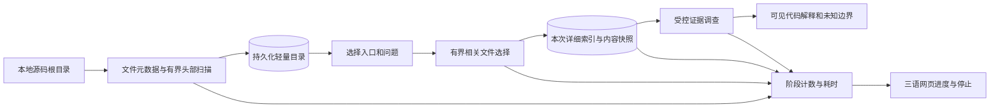

# ADR-0010：轻量源码目录、按需详细解析与局部回答

## 状态

Accepted — 2026-09-14，按用户授权实施；公司环境性能及业务质量仍需实机验收。

## 背景

用户提供约 12,000 个程序、每个约 70,000–80,000 行，源码经常更新，运行环境为本地 SSD/硬盘、8–16GB 内存的普通笔记本，Python 版本可能为 3.14。按这个口径，总量约 8.4–9.6 亿行。旧入口在提问前多次全量读取、计算内容 Hash，并建立逐语句索引；网页只显示等待，用户无法判断卡住或仍在工作。COPYBOOK 和框架闭源对象不可能全部取得。

## 决定

网页默认建立轻量目录，用户选入口后才建立有界的详细索引。保留 Python 标准库、SQLite 与单后台任务，避免增加公司笔记本的安装和运维负担。命令行兼容原默认 `full`，大库命令明确要求 `--index-mode catalog`。

目录先读取最多 16KiB 以定位主 PROGRAM-ID；需要时继续读取，默认头部上限 256KiB。无法在头部识别的可读程序保留文件路径入口，不伪装成完整语句解析。后续 PROGRAM-ID、嵌套程序及依赖可能尚未发现。`source-catalog.sqlite` 持久化文件状态和头部结果；大小、修改/变更时间、文件标识与读取选项不变时不再打开正文。新改文件更新，删除文件移除，每个文件提交后可复用。

默认详细范围为 24 文件、2 层、每个候选最多扫描 2MiB 以发现相关引用、总源码最多 16MiB。选择器可配置文件/深度等预算；达到上限时报告被截断范围，不能描述为全库完整分析。单个入口超出字节预算会明确要求缩小范围。详细构建逐文件读取、解析、写入后释放，未改文件复用，范围未改则跳过 COPY/CALL 派生关系重建。按文件批量清理全文检索记录，避免逐语句重复扫描。

目录版本和内容证据快照使用不同字段。目录状态不是全库内容校验；模型调查前后仍核对本次详细范围内的内容 Hash。强制内容校验会流式读取全库正文，比常规目录更新慢，不作为首次接入默认值。

缺失 COPY、闭源 CALL 或配置仅限制相关结论。已有证据且工具预算允许时，连续搜索无进展会收束到一次证据读取；通过独立检查的陈述保留，未支持陈述单独移除并返回 `PARTIAL`。错误引用、Hash 不符、快照错配及工具协议违规仍阻断。静态代码解释不意味着能执行或模拟闭源对象。

## 运行、故障与性能约束

进度通过真实后台计数提供：目录扫描时总量未知；目录更新时显示文件完成/剩余，解析大文件时另外提供行数。耗时持续增长，预计剩余按当前阶段或当前文件计算，不能稳定估计时显示“估算中”。页面刷新后恢复当前任务，短暂断连重试并提示连接状态。停止请求在可检查点生效；目录保存已完成文件，详细索引保持完整事务，不发布半成品证据。长 SQL/COPY/模型调用可能需要当前步骤结束才响应停止。

详细入口失败时保留可用目录以选择其他程序，但清空当前答案和证据授权。目录查询在界面中每页最多 100 项；入口搜索最多列出 100 项及当前选中项，避免渲染 12,000 个下拉选项。

本机合成基准验证的是目录宽度、单大文件与增量复用，不能外推十亿行全库耗时。性能结果、数据构成和内存口径见[实施验证报告](../reports/2026-09-14-large-source-intake.md)。生产验收需在公司电脑测首次目录、无改刷新、单文件更新和典型入口深度解析，记录峰值内存、索引磁盘占用及完整性边界。

## 取舍与替代方案

继续全量详细索引再加进度条，无法消除十亿行数据的读取、解析与存储成本，因此不选。直接增加并发会扩大内存压力并争用 SQLite 写入，不作为 8–16GB 笔记本默认。换成独立搜索/图服务可以作为后续集中部署方案，但现在引入服务依赖不能解决当前本地可用性。

代价是首次接入只得到可定位的目录；目录缓存不是内容证明，有界依赖选择也会漏掉较后位置、复杂动态调用或深层依赖。用户需要明确选择入口并阅读范围提示。收益是源码规模不再强迫每次问题都先完成全库逐语句索引，未改文件可复用，缺源不会阻止独立可见事实的解释。

## 参考

- [最新使用手册](../15-system-user-manual.md)
- [工作台交互契约](../leadership-demo/workbench-ui.md)
- [框架源码与契约边界](./0008-framework-source-and-contract-boundaries.md)
