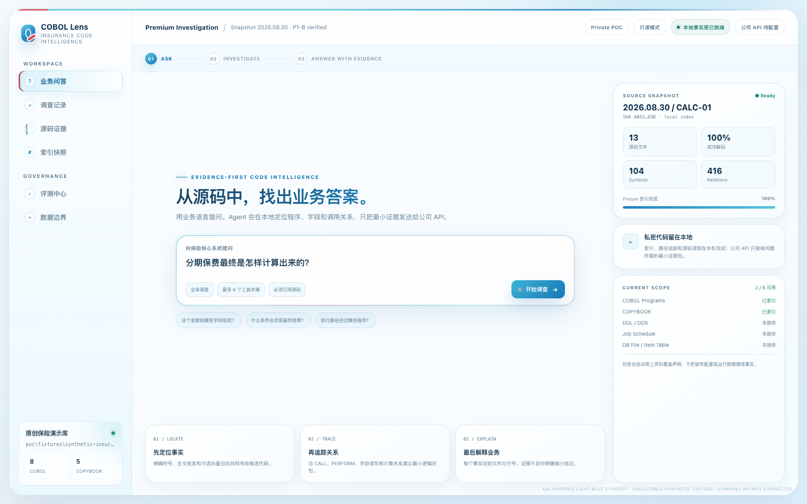
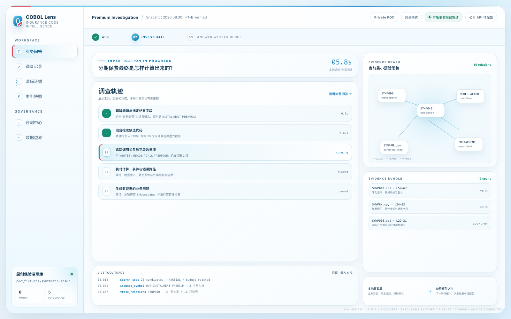
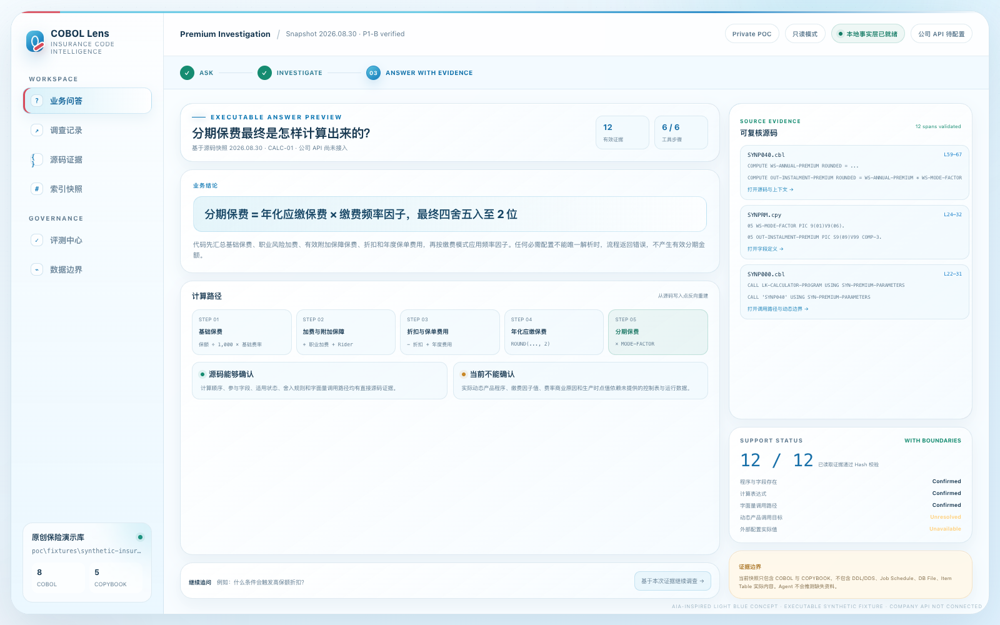

# COBOL Evidence Analyst — 领导演示包

核心判断：当前演示已经真实证明“源码事实层能够形成可复核业务答案”，但公司大模型 API 尚未接入，因此它是 P1-B 可执行证据演示，不是已经上线的完整对话 Agent。

## 演示入口

- [打开交互式演示](./prototype.html)
- [查看 CALC-01 六步执行记录](./p1b-executable-demo.md)
- [查看 P1-B 项目进度报告](../reports/2026-08-30-p1b-progress-report.md)
- [打开领导审阅 Word 报告](../reports/COBOL-Agent-P1B-Progress-Report.docx)

## 三态演示

### 1. 用户用业务语言提问

用户只需要输入“分期保费最终是怎样计算出来的？”。页面同时展示当前资料范围：8 个 COBOL、5 个 COPYBOOK；DDL/DDS、Job Schedule 和真实控制表尚未提供。

### 2. Agent 调查源码与关系

调查过程只展示工具、证据和状态，不展示模型私有思维链。真实本地工具包括 `search_code`、`inspect_symbol`、`trace_relations` 和 `read_evidence`，并受到 6 步、3 跳、200 条边和证据预算限制。

### 3. 返回带源码证据的业务回答

回答把计算结论、代码实现、源码位置和不能确认的边界放在同一屏。动态产品调用和外部配置实际值保持 unresolved / unavailable，不根据命名猜测。

## 演示时必须说明

- 13 个文件、104 个符号、416 条关系、6 次工具调用和 12 段证据来自当前原创合成代码库的真实离线运行。
- 三张截图由当前 `prototype.html` 在 1600×1000 下重新生成，日期为 2026-08-30。
- 页面里的 05.8s、0.7s 等逐步时间是演示呈现值，不是性能测试结果；本轮自动测试实际约 0.1 秒完成。
- 公司 OpenAI-compatible API 尚未连接。P3 才会让模型根据自然语言自主选择这四个调查工具并组织回答。
- `COBOL-Agent-Leadership-Demo.docx` 是 2026-08-29 的旧概念文档；当前结论以本说明、交互式页面、六步执行记录和 P1-B Word 报告为准。

## 建议的五分钟讲解顺序

1. 先展示提问页，说明业务人员不需要知道程序名或字段名。
2. 点击“开始调查”，说明 Agent 不是一次性把上万文件发送给模型，而是在本地逐步缩小证据范围。
3. 点击“查看完整回答”，解释已确认事实与资料缺口为什么必须同时呈现。
4. 打开六步执行记录，证明页面背后已有真实工具结果，不是纯视觉原型。
5. 以 P3 退出门槛收尾：接入公司 API 后，同一问题必须在 6 步内自动取得相同证据并生成可核验中文回答。
