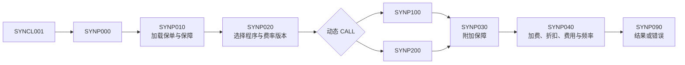

# M1 合成系统蓝图：保费与保单费用计算

> 核心判断：合成系统必须小到可以人工验证，又要难到足以暴露代码理解 Agent 的真实问题；因此采用一个入口、动态产品计算器、多张控制表和跨程序参数传递。

状态：`Draft for review`  
性质：完全原创，不代表任何公司、产品、法规或 DXC 实现

## 1. 业务范围

系统为一张合成保障型保单计算年化应缴保费和分期保费。保单包含一个基础保障和零到多个附加保障；计算依据保额、被保人年龄、吸烟标志、职业等级、产品、保障状态、缴费方式和调用方提供的计算基准日。

到达年龄按计算基准日已经完整度过的年数计算；当出生日期为 2 月 29 日而计算年份不是闰年时，以 2 月 28 日作为当年生日。路由和费率记录必须满足 `EFFECTIVE-FROM <= 计算基准日 <= EFFECTIVE-TO`；没有命中或同时命中多条都视为配置错误，不能自行挑选一条。

系统只解释“代码在给定输入和费率快照下怎样得到结果”。费率的商业理由、真实市场定价和监管要求不属于场景事实。

## 2. 原创计算规则

所有金额先以四位小数参与中间计算，年化金额和分期金额最终采用四舍五入保留两位小数。

```text
基础保费       = 基础保障保额 ÷ 1,000 × 基础费率
职业风险加费   = 基础保费 × 职业加费百分比 ÷ 100
附加保障保费   = Σ（有效附加保障保额 ÷ 1,000 × 对应附加费率）
高保额折扣     = 基础保费 × 折扣百分比 ÷ 100（达到门槛时）
年化应缴保费   = 基础保费 + 职业风险加费 + 附加保障保费
                 - 高保额折扣 + 年度保单费用
分期保费       = 年化应缴保费 × 缴费频率因子
```

费率通过 `产品 + 保障代码 + 到达年龄 + 吸烟标志 + 生效日期` 选择；职业加费通过职业等级选择；折扣、保单费用和缴费频率因子分别来自独立控制表。找不到必要基础费率时必须停止计算，不能使用静默默认值。

本场景规定：状态为 `PENDING` 或 `INFORCE` 的保单允许计算；`LAPSED`、`CANCELLED` 不计算。无有效附加保障时附加保费为零。职业等级在控制表中没有记录时返回错误，而不是假定零加费。保额小于等于零时返回输入错误。

## 3. 程序边界

程序名称均使用 `SYN` 前缀，避免被误认为真实系统对象。

| 合成对象 | 职责 |
| --- | --- |
| `SYNCL001` | CL 入口，接收保单标识和计算日期，调用 COBOL 协调程序 |
| `SYNP000` | 调查主入口，校验请求、编排加载、路由、计算和结果返回 |
| `SYNP010` | 加载保单、被保人、基础保障和附加保障数据 |
| `SYNP020` | 依据产品控制表解析产品计算程序名和费率版本 |
| `SYNP100` | 合成产品 A 的基础保费计算器 |
| `SYNP200` | 合成产品 B 的基础保费计算器，用于验证动态调用分支 |
| `SYNP030` | 遍历有效附加保障并计算附加保费 |
| `SYNP040` | 计算职业加费、高保额折扣、保单费用和缴费频率换算 |
| `SYNP090` | 统一错误、返回码和结果映射 |

`SYNP000` 不直接写死产品计算器，而是从路由控制表得到程序名后执行 `CALL identifier USING ...`。这不是复制 DXC，而是用公开 COBOL 能力构造一个需要静态候选解析的企业式难例。

## 4. 数据与 COPYBOOK

| 合成对象 | 内容 |
| --- | --- |
| `SYNPOL.cpy` | 保单标识、产品、状态、生效日期、缴费方式 |
| `SYNINS.cpy` | 出生日期、吸烟标志、职业等级 |
| `SYNCOV.cpy` | 基础及附加保障代码、保额、状态 |
| `SYNPRM.cpy` | 跨程序计算参数、累计金额、返回码和诊断字段 |
| `SYNERR.cpy` | 统一错误码与错误分类 |
| `SYN_POLICY` | 合成保单数据 |
| `SYN_INSURED` | 合成被保人数据 |
| `SYN_COVERAGE` | 基础及附加保障数据 |
| `SYN_CALC_ROUTING` | 产品到计算程序及费率版本的时点映射 |
| `SYN_BASE_RATE` | 基础保障费率 |
| `SYN_RIDER_RATE` | 附加保障费率 |
| `SYN_OCC_LOAD` | 职业等级加费百分比 |
| `SYN_DISCOUNT` | 高保额折扣门槛与百分比 |
| `SYN_MODE_FACTOR` | 年缴、半年缴、季缴和月缴因子 |
| `SYN_POLICY_FEE` | 年度保单费用 |

## 5. 执行与证据路径



回答“分期保费怎样计算”所需的最小完整逻辑闭包至少包含：入口与状态校验、数据加载、路由表选择、动态调用候选、产品基础计算、附加保障循环、调整与费用、缴费因子、舍入和错误路径。只找到最终乘法语句不算完成调查。

## 6. 预设难点

- 同一概念在程序间使用不同字段名，通过 `SYNPRM.cpy` 按参数位置传递；
- 动态调用目标来自时点路由表，静态分析只能先产生候选及约束；
- COPYBOOK 展开后必须仍能返回原始 COPYBOOK 和引用位置；
- 费率和路由都受生效日期约束，不能简单选择“最新”记录；
- 一个附加保障缺少费率时，整个计算失败，不能只跳过该保障；
- 错误码经多个程序传回入口，Agent 必须解释失败路径而非只解释成功路径。

## 7. 蓝图评审门槛

在写 COBOL fixture 前，必须能够人工回答全部金标准问题，并为每题列出必要程序、字段、关系和控制表。若某题的正确证据仍有争议，应先修改蓝图，不能把争议埋进代码。
